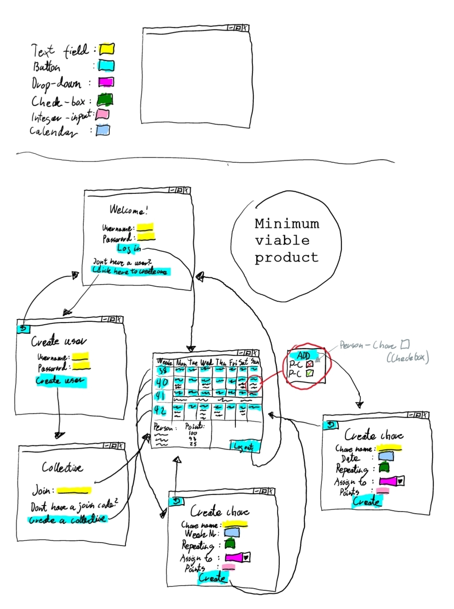

# Chore Manager
## Description
Chore Manager is an application designed to help users manage their daily and weekly chores. The application allows users to create chores, assign chores to other users, and mark chores as completed. The applicaion also shows a calendar view with the daily and weekly chores for the current and coming weeks. A user gets points for completing a chore. The application also has a leaderboard that shows how many points each user has. The application also allows users to create collectives, which are groups of users that share chores.

### Login view
The login view allows users to login to the application. The login view is the first view the user sees when starting the application. A user can login by entering their username and password. The login view also has a button for creating a new user. 

### Create user view
This view lets the user register an account by entering a username and password.

### Join collective view
After having created an account, a user should be able to join a collective. The join collective view allows the user to enter a collective name or id to join the collective. The join collective view also has a button for creating a new collective.

### Main view
When a user is logged in and a part of a collective, they can see the main view of the application. The main view shows a calendar view with the daily and weekly chores for the current and coming weeks. The main view also lets you click on a chore to mark it as completed. There is also a button for creating a new chore, and users can click on a certain day or week to create a new chore for that day or week. There is also an overview of how many points each user has.

### Create chore view
After pressing a button to create a chore, the create chore view is shown. The create chore view allows the user to create a new chore. The user can enter a title, assignee, if the chore is weekly and if it is recurring.

### The minimum viable product
