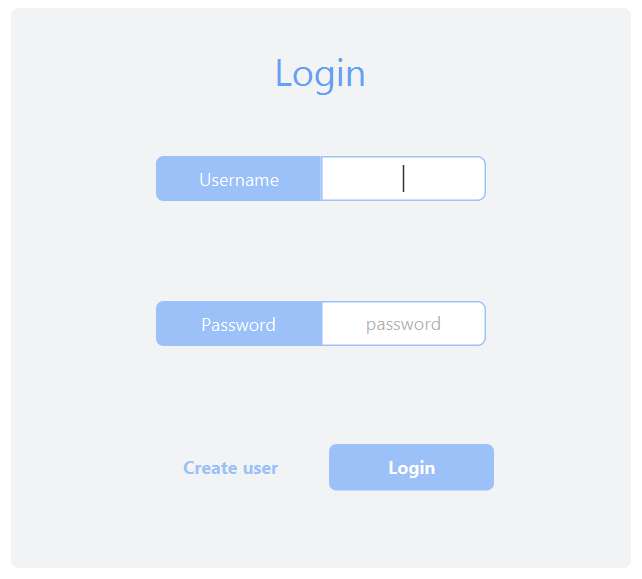

# Chore Manager
## Description
Chore Manager is an application designed to help users manage their daily, and weekly, chores. The application allows users to create chores, as well as assign chores to other users within their household. Chores will show up in a calendar view, that shows both past and upcoming chores. A leaderboard system is implemented so that the members of a household can rack up points by completing chores, and compete against each other.

## Traversing through the application

||
|:--:|
|State diagram for the application|

The applications contain many views, that we will call pages. We will now go more in-depth on what the different pages do and how users will traverse through them.

### Login page
When a user runs the application, they get presented with the login page. Here the user can create a new account by clicking "Create user", or log in to an existing one. After filling in the details and clicking "Log in" the user will be taken to one of two pages. If the account has not yet been assigned to a collective, the user will be taken to the "Join collective" page. Otherwise, the user will be taken to the main calendar page.

||
|:--:|
|The login page|

### Create user page
This page lets a user create an account by entering a username, a display name and a password. After successfully creating an account, the user will be taken to the join collective page. 

If the user already has an account and got to this page by accident, they can go back to the login page by clicking "Go back".

||
|:--:|
|The create user page|

### Join collective page
After having created an account, the user should be able to join a collective. On this page the user is presented with two choices: join an already existing collective, or create a new one. 

The user can join a pre-existing collective by entering its join-code. If the join-code is entered correctly, they will be sent to the calendar page after clicking "Join".

If the user wants to create a new collective, they can click "Create collective". This will take them to the create collective page.

||
|:--:|
|The join collective page|

### Create collective page
On this page a user can create a collective by typing in its name and then click "Create". Then they will be taken to the calendar view.

If the user has a join-code and got here by accident, they can click "Go back" to go back to the join collective page.

||
|:--:|
|The create collective page|

### Calendar page
The calendar page is where users will spend the most time. From here users can access most other pages. The calendar page consists of a calendar that displays past and upcoming chores, as well as a lot of buttons. 

After a user has created a brand new collective, the calendar page will look quite empty.

||
|:--:|
|The calendar page when a collective is first created|

||
|:--:|
|The different colors that days have convay different things|

If a user clicks "Add" on one of the days or weeks, they will be sent to the create chore page. Once the user has filled in the necessary information, one or more chores will pop up in the calendar.

If the user clicked "Add" on one of the days, a chore will be displayed on that day in the calendar. If the user clicked "Add" on a week, a long chore will be displayed on that week. It doesnt make sense to add chores to days before today, therefore buttons from past days have been replaced with labels.

||
|:--:|
|A day chore and a week chore|

To mark a chore as completed, or view more information about a chore, the user will first have to click said chore. This will send the user to the chore information page. The chore will get a green border once it has been marked as done.

||
|:--:|
|A chore marked as done|

However, if a user has ignored a task, and left it unfinished past its deadline, it will get a red border, and be pushed to the current day. This border color will persist until the user has marked it as done, which will turn the border green.

||
|:--:|
|An overdue chore|

Logging out is done by clicking the "Log out button". This will take the user to the login page.

If the user wants to see the leaderboard over who has racked up the most points in their collective, they can do so by clicking the "Leaderboard" button. They will then be sent to the leaderboard page. 

Sharing a collectives join-code can be done by clicking the "Code xxxxxx" button. This will put the join-code on the users clipboard.

### Create chore page
The user will be sent to this page after a user has clicked "Add" on a day or week. Here the user can fill out the necessary information about the chore, then click "Create" to create the chore. They will then be sent to the calendar page. If the user wants to go back to the calendar page without creating a chore, they can do so by clicking "Go back".

||
|:--:|
|The create chore page|

The "Name of chore" input is supposed to take in a short description of the chore. This description, as well as who the chore is assigned to, is what will show up on the calendar. 

The assign chore input consists of a dropdown menu that lists all members of the collective, then the user can pick who they want to assign the chore to. The assignee that is picked will receive the points once the chore is done, however, everyone can mark the chore as done. 

The background color the chore will have in the calendar is decided by the color-picker input. The application automatically deduces whether the color of the text should be black or white to improve readability. Here the text color that was chosen is white because the background color of the task is dark blue.

||
|:--:|
|A blue chore with white text|

The points-slider defines how many points a chore is worth, while the repeats-slider defines how many weeks a chore should be repeated. The repeats-slider is very useful if a user has a weekly chore that needs to be done, for example taking out the trash every Friday for a set amount of weeks. This way the user doesn't have to create a new chore every single week.

### Chore information page
After clicking on a chore, the user will be taken to this page. This page displays the description of the chore, when it's due, who it's assigned to, how many points it's worth, as well as its current state. The user can change the state of the chore by clicking the checkbox. 

If a chore is overdue, the deadline will be replaced with the text "[OVERDUE]" until it is marked as finished.

||
|:--:|
|The chore information page|

||
|:--:|
|The red box with an x represents that the chore is unfinished, green box with a white checkmark represents that its done|

The chore will be deleted if the user clicks "Delete". This means it will no longer show up in the calendar, and if the chore was completed, points will be deducted from the assignee.

### Leaderboard page
This page displays how many points each user in the collective has. Users are displayed in descending order, with the user with the most points on top.

Clicking "Go back" sends a user back to the calendar page.

||
|:--:|
|The leaderboard page|

