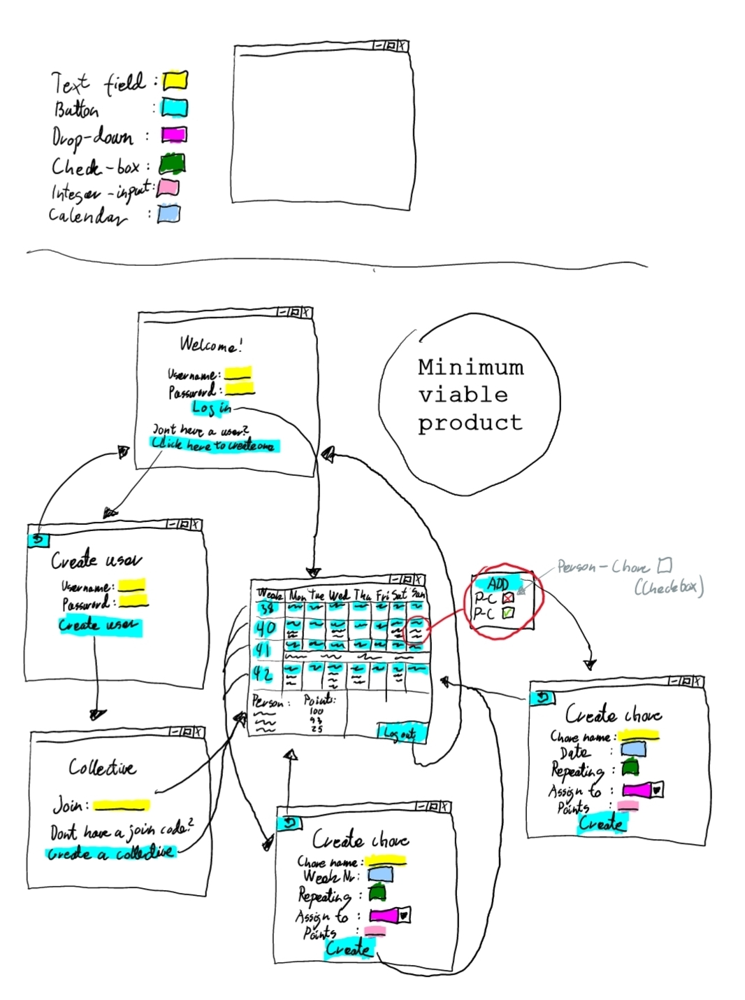

# Deliverable 1
## Progress
For this deliverable, we have implemented basic functionality of the application. The functionality fulfills the requirements stated in the [first user story](UserStory1.md). Thus, a lot of the core logic is in place, and we have a basic UI. 

The overarching plan is essentially described in this graphic over the minimum viable product.

||
|:--:|
|Minimum viable product| 

So far we have just had time to create what we plan to have as the applications main view. Therefore we have not implemented any login functionality yet. This means that there is only one temporary user object which chores are assigned to. Creating custom chores from the UI is not implemented either, but the parameters and part of this functionality is already in place in the core module. Persistency has been implemented using the JSON.simple module.
 
||
|:--:|
|FXML structure for the main view| 

## How to use
First you run the project as described [here](../../README.md).
The project so far is a calendar where you can click on days to add "Chore"-notifications. On exit these notifications will be saved in the calendar, so that when you re-run the project, said notifications will appear in the calendar. This is what the application should look like if everything is installed and run correctly:

||
|:--:|
|The main view|

## Work-structure
We held two two-hour meetings every week where we agreed on a backlog of issues to work on. The first couple of meetings included a lot of planning and initial setup of the project, such as setting up Maven and JaCoCo. In later meetings, we spent more time working on solving the issues, such as creating the main view, designing it with CSS and so on.