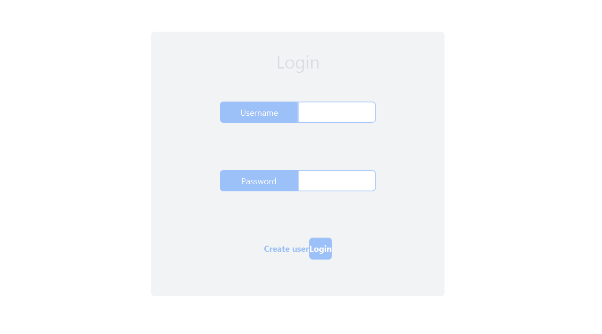
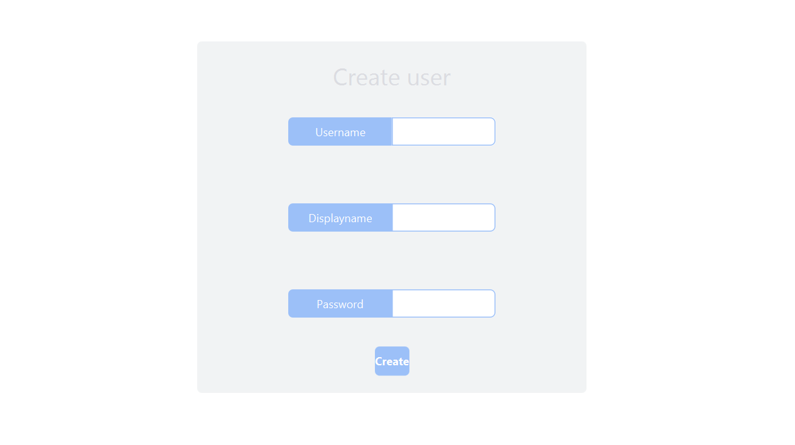
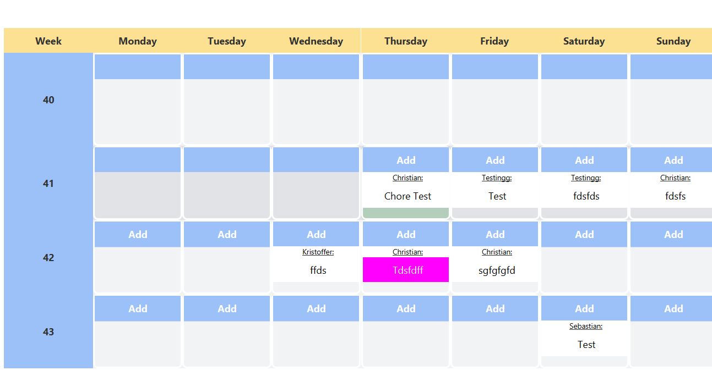
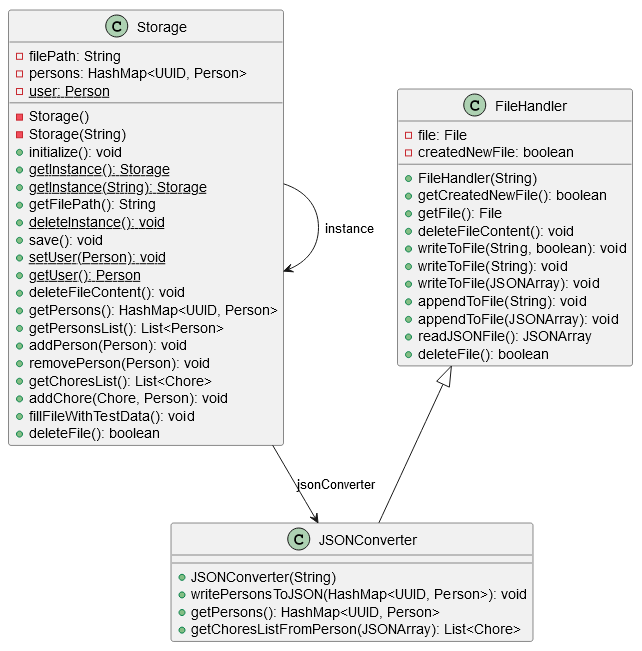

# Deliverable 2

## Application progress

**For deliverable 1, we made it so that a user can:**
- Add a chore 
- Specify the specific date and week a chore should be executed.
- View the whole month with chores on specific dates in specific weeks (UI).
- Saving the chore.

These features combined into the completion of our first user story: **"Lisa’s mid-mid-life crisis"**


### Acceptance criteria for deliverable 2

Complete ["Fading plants"](../../UserStory.md) and ["Jealousy, jealousy"](../../UserStory.md).

**A user should be able to:**
- Choose 
	- Name
	- When the task should be done
    - Color of the task

  in a chore-creation menu when creating a task (from **"Fading plants"**)
- Create an account by choosing a username and password. This should be done when opening the application the first time (from **"Jealousy, jealousy"**)
- Be able to log into their account when the application is opened (from **"Jealousy, jealousy"**)
- Be able to log out of their account (from **"Jealousy, jealousy"**)
- Assign chores to themselves, as well to other users. This should be done in the chore-creation menu (from **"Jealousy, jealousy"**)
- Add a label to each chore in the view that states who the task is assigned to (from **"Jealousy, jealousy"**)

### How far we got

We completed both ["Fading plants"](../../UserStory.md) and ["Jealousy, jealousy"](../../UserStory.md). We also added an additional feaure from ["Scoreboard"](../../UserStory.md): that a user should be able to define how many points a task is worth. The reason for only developing this part of **"Scoreboard"** so far, is that the addition of a point-amount-input in the chore-creation-menu was a minor task that could easily be done, as the chore-creation-menu had already been done.

By implementing these user-stories, the amount of pages with corresponding controllers have quadrupled, as we now have pages for:
 - Logging in
 - Creating users
 - The calendar
 - Creating chores

||
|:--:|
|Logging in| 

||
|:--:|
|Create user| 

||
|:--:|
|Calendar| 

||
|:--:|
|Create chore| 

## Checkstyle

Checkstyle was implemented, and we used the Google coding conventions from [Google Java Style](https://google.github.io/styleguide/javaguide.html) as a template. We made some small changes.

### Changes to the Google coding conventions
#### Indentation:
One change being that we doubled the indentation size from 2 to 4. The reason for this is that we are all more used to an indentation size of 4, and that we find the code to be easier to read with the larger indentation.

#### Abbreviations:
We also increased the allowed abbreviation length from 0 to 4. This is to allow uppercase sequences like "JSON" and "UUID" in method and variable names. Again, this is because we think it improves readability and code clarity.

#### Import order:
We also tried to change the import order check to fit with [RedHat's](https://marketplace.visualstudio.com/items?itemName=redhat.java) default setting. After spending hours trying to get it to work, we decided to just get rid of the rule altogether. Our time is better spent on other things. The code formatter already sorts the imports whenever we save the file, so as long as everyone does that, it shouldn't be a problem.

#### Line length:
The formatter also handles line length, and splits lines if they cross a certain length threshold. A problem we encountered was that the formatter does not count the indentation as part of the line length, whilst Checkstyle does. Due to this we decided to increase the allowed line length in Checkstyle to compensate for indentation.

#### Variable names:
The regular expression that matches variable names also had to be changed in order to allow UPPERCASE_WITH_UNDERSCORES for final variables.

#### Brackets:
We decided to get rid of the requirement for curly brackets in IF-statements, since short statements have improved readability without superfluous brackets. For example:
```java
if (!this.containsInteger)
    returnString += " - contain an integer.\n";
```
Instead of:
```java
if (!this.containsInteger) {
    returnString += " - contain an integer.\n";
}
```


## Spotbugs

Spotbugs was also implemented. See the [README.md](/README.md) for how and when it runs. 


## Javadocs and UML diagrams

Javadoc comments were added to most of the code. This will make it easier for everyone to understand what each class and method does. PlantUML diagrams were added to the javadocs through the [UMLDoclet](https://github.com/talsma-ict/umldoclet) plugin. The diagrams are generated from the javadoc comments in the code. See [this file](/README.md) for how to view the javadocs and the diagrams.


## Persistence

The [persistence module](/chore-manager/persistence/) contains the logic for reading and writing to a json file for storage. The file is saved in the home folder of the user. (`System.getProperty("user.home")`). The reason for writing to the home folder is that this ensures that the application does not need special permissions to write the data, as the user has appropriate access to their home directory. In addition storing files in a user's home directory makes the application more portable and independent of the specific system or environment.

Our save model consist of implicit saving, which saves after every action from the user, for example after creation of a chore. This is to ensure that the data is always up to date, and that the user does not have to worry about saving, making it most convenient for users.

We have chosen to use JSON.simple for handling JSON in this project.
The reason is because it's a lightweight and easy-to-use Java library. 
In addition it is a well known library, which means it is well documented and has a lot of resources online.

### Structure progression

We have three classes for handling persistence, [FileHandler](/chore-manager/persistence/src/main/java/persistence/fileHandling/FileHandler.java), [JSONConverter](/chore-manager/persistence/src/main/java/persistence/fileHandling/JSONConverter.java) and [Storage](/chore-manager/persistence/src/main/java/persistence/fileHandling/Storage.java). Each of these classes serve a different purpose.

#### FileHandler: 
This class handles the reading and writing directly to the file. This class uses InputStreams and OutputStreams to be able to read and write. It reads data from the file, then converts it to JSON and returns it. It can also take JSON data and convert it to a string, to then write it to the file.
This class has the lowest level of abstraction in the persistence module.

#### JSONConverter:
This class handles the conversion between the data classes and JSON.simple's JSONArray. It extends FileHandler, and the reason is to make it easier to handle JSON conversion and file reading from the same object with the same initialized variables, which reduces complexity. This class has a higher level of abstraction than FileHandler, but a lower level of abstraction than Storage.

#### Storage:
This class follows the singleton design pattern, which means only a single instance of the class can exist. On startup it reads and parses the JSON file, and stores all information in local variables. Because it stores the information, it does not need to read from the file again. All manipulation of data is done on the local variables, which is saved to the file when the save method is called. This proves to be quite time efficient.

This class has the highest level of abstraction in the persistence module, and is the main class used to handle persistence. This class delegates task down to the other classes with a lower level of abstraction. This class is therefore easy to use, and is the only class that the rest of the application needs to interact with. An example can be the save method, which is done by calling `Storage.getInstance().save()`, which then delegates the task to the other classes. The Storage class is full of easy-to-use methods, which enables us to not worry about the persistence layer when implementing the rest of the application. To ensure `Storage` behaves as expected, we have built a robust testing suite for it.

In all classes that handles JSONArrays, we had to add `@SuppressWarnings("unchecked")`. This is because the JSONArray class is not generic, and is instead a raw type. This means that the compiler cannot check that the JSONArray is of the correct type, and will instead give a warning. We have chosen to suppress this warning, as we are sure that the JSONArray is of the correct type, and there is no way to parameterize it.

||
|:--:|
|This PlantUML diagram is a class diagram of the classes in the Persistence module| 

#### Progression of persistence implementation
The above text explains the current implementation of persistence, but it has gone through many iterations before reaching this point.

The first iteration: This consisted of only the `FileHandler` class which read and parsed the data on every data fetch. This is quite inefficient and proved to be harder to use, as there were "low-level" methods that the rest of the application had to use.

The second iteration: We understood there was a lot of improvements that could be made, so we expanded with the classes `JSONConverter` and `Storage`. `JSONConverter` works the same as it does now, with it only purpose being converting between JSON and data classes. `Storage` however worked quite differently to what it does now. `Storage` used static variables to save and store data. This allowed us to keep the data consistent across the whole application, however this is not considered best practice, and also introduced a lot of complexity. In addition by using static variables, the tests conflicted with the main applications persistence, and we had to implement further complexity to ensure that the tests did not interfere with the main application. This was not a good solution, and we decided to change it.

Third iteration (Current): By researching, we found that a singleton would prove to be best for our use case. This follows the singleton pattern, which is a well known design pattern and considered a best practice. This means that only one instance of the class can exist, and consequently all data is consistent across the whole application.
This pattern massively reduced complexity, and allowed us to make the `Storage` class easy to use and understand.

#### Data representation in JSON:
This is the json representation of the stored data.
It contains a list of Person objects, where every person has a field `chores` which has a list of Chore objects. 
```json
[
    {
        "name": "Sebastian",
        "chores": [
            {
                "timeFrom": "2023-10-06",
                "timeTo": "2023-10-06",
                "color": "#FFFFFF",
                "isWeekly": false,
                "choreName": "abc",
                "points": 0
            }
        ],
        "uuid": "d50d293a-1c2f-403c-bf6c-d03e3a5d6d09"
    },
    {
        "name": "Kristoffer",
        "chores": [],
        "uuid": "fc6f0f7e-27a3-401f-916d-69a19e6f50ea"
    },
    {
        "name": "Christian",
        "chores": [
            {
                "timeFrom": "2023-10-05",
                "timeTo": "2023-10-05",
                "color": "#FFFFFF",
                "isWeekly": false,
                "choreName": "Chore Test",
                "points": 10
            },
            {
                "timeFrom": "2023-10-05",
                "timeTo": "2023-10-05",
                "color": "#FFFFFF",
                "isWeekly": false,
                "choreName": "Chore Test 2",
                "points": 10
            }
        ],
        "uuid": "4ae82e25-a082-437d-ae2a-2e0d229137dd"
    },
    {
        "name": "Lasse",
        "chores": [],
        "uuid": "00a62454-5997-42df-8986-641690135ac4"
    }
]
```