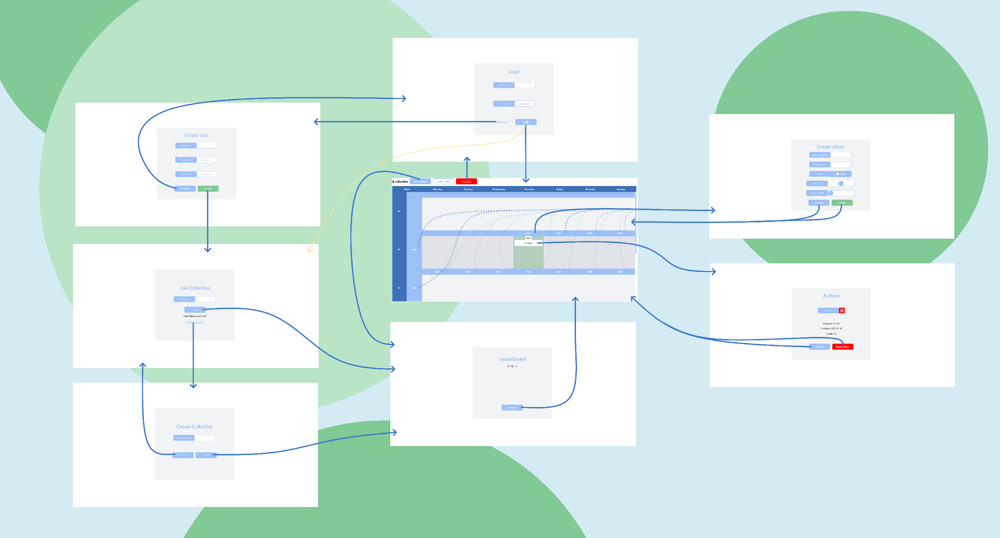

# Deliverable 3

## Application progress
**For deliverables 1 and 2, we implemented these user stories:**
- **"Lisa’s mid-mid-life crisis"**
- **Fading plants**
- **Jealousy, jealousy**

### Acceptance criteria for deliverable 3

Instead of creating a new client, we are going to implement more features.

**Complete:**
- ["Scoreboard"](../../UserStory.md)
- ["Popularity contest"](../../UserStory.md)
- ["Chopping down Christmas tree in july?"](../../UserStory.md)
- ["'Do(n't) put off until tomorrow what you can do today' - Benjamin Franklin"](../../UserStory.md)
- ["Spacetime"](../../UserStory.md)
- ["Detective"](../../UserStory.md)


**A user should be able to:**
- Receive the stated amount of points when having done a chore
	- The points will add up, and everyone in the group should be able to see the "scoreboard" (from **Scoreboard**)
- Create a group. Each group has its own calendar view, where the groups members can view their chores (from **Popularity contest**)
- The group should have a unique code, that can be passed around to roommates so that they can join the group when they first sign up (from **Popularity contest**)
- Delete chores (from **Chopping down christmas...**)
- Mark a chore as completed if completed (from **'Do(n't) put off until...**)
- If the chore is not completed within the time frame it is sat to, it should be pushed to the next day and marked as high priority. This could be achieved by changing the styling and marking it in red (from **'Do(n't) put off until...**)
- State how many weeks a chore should repeat in the chore-creation menu (from **Spacetime**)
- Create chores that can be done every day of the week (from **Spacetime**)
- View:
  - name of the chore
  - when the chore is overdue
  - the status of the chore
  - who the chore is assigned to 
  in a menu (from **Detective**)


### How far we got

We completed all the user stories, meaning we managed to finish the application. As we added features, we also realized that some quality of life (QOL) features were missing, such as "Go back" and "Log out" buttons as well as an easy way for members of a collective to spread the "collective code" around. These QOL features combined into the user story creatively named ["Quality of life"](../../UserStory.md).

We now have pages for:
 - Logging in
 - Creating users
 - Joining collectives
 - Creating collectives
 - The calendar
 - Creating chores
 - Viewing info about chores
 - The leaderboard

 ||
 |:--:|
 |Showcase of all pages|

## Description of the finished product

 ||
 |:--:|
 |State diagram for the application|

The figure above shows a state diagram of how the different pages interact. You start at the "Logging in" page. From there you can either log in to an existing user or create a brand new one by clicking "Create user" and filling in the details on the "Creating users" page. 

After creating a user, or logging in to a user that has not yet been assigned to a collective, you will be taken to the "Joining collectives" page. From here you can either choose to join a collective by typing in a code given to you by someone who has created a collective already or create a brand new collective by clicking the "Create collective" button and filling in the name of the collective.

Finally, you will be taken to the main page, "the calendar" page. From here you can log out again, by clicking "Log out", go to the leaderboard for your collective by clicking the "Leaderboard" button, copy your collectives code by clicking the "Code: [collective code]" button, or you can create chores. Create day-chores by clicking "Add" on a specific day, or create week-chores by clicking "Add" next to the number of the week you want to add a week-chore to. If you have created chores already, you can click on the created chores to view more info about them.

[Click here](../../chore-manager/README.md) for a more in depth description of how all scenes interact.

## Diversions from the original plan

 Overall we followed the plan for minimum viable product described in the graphic [presented in the readme of deliverable 1](../release1/README.md) closely, but made some diversions. These diversions were mainly in the name of consistency.

 ||
 |:--:|
 |Plan versus finished product|

 ||
 |:--:|
 |Plan versus finished product: here planned views are colored the same as their implemented counterparts|


The "Joining collectives" page and the "Creating collectives" page were initially planned to be just one page. However, as we made the pages for joining and creating collectives, we felt that the idea of creating a user and logging into a user, are ideas that each map to creating a collective and joining a collective. Therefore, since joining and creating a user were on separate pages, creating a collective and joining a collective should also be, for consistency. 

Moving the leaderboard from under the calendar, to its own page, was another diversion from the original plan. This was done to make the calendar page seem less overcrowded with features. The "Viewing info about chores" page was intended to just be a popup where you could mark a chore as done, however, we realised that we needed a way to display extra information, and because of that this also ended up being its own page. **The reasons we were able to add these extra pages were threefold.**

Firstly, we originally planned that the creation of week-chores (chores that can be done over a week), and the creation of day-chores (chores that need to be done on a specific day), should have their own pages. This ended up not being necessary as the only difference between a week-chore and a day-chore, is that day-chores have the same start and end date, while week-chores end-date are 7 days after their start date. Therefore they both got the same creation page. Therefore we saved a bit of time on that. 

Secondly, between deliverables 1 and 2, we created most "page-types" needed for the rest of the application. As visible in the overview of all pages, most pages follow a similar structure. Because of this, when we created new pages, we could use the already implemented pages as starting points. We could copy one of the old fxml-files, edit where needed, and pass it off as a new page. This saved us a lot of time. 

 ||
 |:--:|
 |Pages follow a clear structure|

Finally, the framework for going between pages made between deliverables 1 and 2 also saved us a lot of time. Instead of each controller having to define its own method for going from one page to another, which we had done up to that point, we instead followed the "Don't Repeat Yourself" (DRY)principle. We defined a static method in the App class in the UI that does this. We could then call this method from anywhere in the UI, and easily switch between scenes. This saved us a lot of time for this delivery, as we added a lot of buttons that take you from one page to another, such as the "Go back" buttons.

```java
public static void switchScene(String fxmlName) {
    try {
        FXMLLoader fxmlLoader = new FXMLLoader(App.class.getResource(fxmlName + ".fxml"));
        Parent parent = fxmlLoader.load();
        scene.setRoot(parent);
    } catch (IOException e) {
        System.out.println(e);
    }
}
```

Another diversion was a switch from weekly, recurring chores, to the ability to state how many weeks a chore should repeat. Weekly tasks were tasks that were going to reoccur every week, until it was deleted by a user. We instead gave the user the ability to choose how many weeks a chore should repeat, as deletion should be reserved for when the user has done something wrong, like spelling a chore wrong or assigning the wrong person, and not be something a user is forced to in able to use the application. 

 ||
 |:--:|
 |The user can decide how many weeks a chore should repeat|
 

## Test coverage
According to JaCoCo, our test coverage was at about 70% after the second deliverable. We have worked on improving this and getting as close as possible to 100%. Some code branches are hard to get coverage for since they are only executed in case of an error. We have tried to test these cases as well, but it is not always possible to get 100% coverage.

When using JaCoCo, we learned that just looking at test coverage can be misleading. JaCoCo marks code as "covered" if it is run during the test phase. However, this does not mean that the code is explicitly tested. It might just be run as periphery code during another test. We have tried to avoid this by being aware of it and writing tests that explicitly test all the code we want to test.


## Workflow 

### General Workflow
In the last stage of our project, a bit has changed when it comes to our general workflow. As before we have continued holding two meetings a week. As the deadline has approached these meetings have gotten longer and longer,in order to finish our application on time before the deadline. As with deliverable 2, we started this last stage by looking at the feedback we had received from the previous deliverable, before starting looking at the requirements for deliverable 3. What has changed is that we have made greater use of pair-programming, and agile methods like the Scrum framework, which I will come back to. 

### Issues
For this last deliverable, we have created issues according to the feedback we received from the previous deliverable. This has helped us deal with these issues in a structured and orderly manner. Next, we started making issues with the requirements for deliverable 3. Making every issue as concrete as possible, making it as easy as possible for the developer to deal with. This has also made sure that every issue is dealt with in accordance with the issues level of importance. Most issues we have made has been marked with a label stating the importance and degree of urgency, always making it clear what issues should be the top priority. 


### Branching
We have continued to use branching diligently throughout the project until the end. This last deliverable is no exception. As with previous deliverables we have used the same strategy when it comes to branching. This is described in the first deliverable and the [Developer Guide](/DEVELOPER_GUIDE.md). Our master branch houses our production-ready code,  All issues are branched into their own branch to minimize conflicts and securing that the master branch is always working. We have continued to adopt the same good practices as with previous deliverables. This includes: 

- Creating merge requests when an issue is finished, having at least one team member review and approve the code before being able to merge with `master`.

- Strict naming convention: `{issue-number}-name-of-branch`. 

This is also documented in [Developer guide](/DEVELOPER_GUIDE.md). 

Small and frequent commits have helped in tracking changes and easier identifying when and why a particular change was made.

When merging to the master branch, we choose to keep the history from the branches (Merge commits). The alternative would be to squash our commits into a single commit, which do provide a shorter and cleaner, but also loses context, and it becomes more difficult to identify introductions of bugs as the history is condensed. There is pros and cons to everything, but for out particular project we found this to be the superior solution. 


### Milestones
As with previous deliverables we have created milestones for the project. These milestones have been used to group issues together. 


### Pair-programming
Pair programming has become a notable part of our approach, especially towards the end of the project. As the project grew in size, the development of new features and debugging became increasingly complex. Gradually adopting more and more pair-programming has helped us effectively tackle these complexities and issues. This method has not only improved the overall quality of our code but also streamlined the problem-solving process. By working closely together, we have been able to quickly share insights and alternative perspectives, leading to better solutions and quicker fixes. Additionally, this approach has significantly reduced the occurrence of bugs and errors, ensuring a more reliable and robust end product.

### Agile methods
Agile methods have gradually become a more significant part of our workflow. As the project has gotten bigger, and more time is spent working outside the set meetings, we've found that Agile practices, particularly Scrum, enhance our flexibility and responsiveness to change. Implementing Scrum has brought structure and clarity to our process, with regular sprints and sprint planning meetings ensuring that we are always working towards well-defined goals. While daily stand-ups for obvious reasons has not been a part of our project, we have implemented a simplified version of the Scrum framework:

- In our project, we've embraced a flexible approach to Scrum, adapting its roles and processes to fit our team's workflow. For roles like the Product Owner and Scrum Master, we've opted for a collaborative approach rather than assigning them to specific individuals. This has encouraged a sense of shared responsibility and made a more inclusive decision-making process.

- Product Backlog: We created lists of user stories consisting of features that could potentially go into the product. This list has evolved throughout the project and each item is prioritized based on its importance and impact on the project.

- Sprint backlog: The highest priority user (aka the feature we decide we want to implement) goes into the sprint backlog. These are the tasks we aim to in the upcoming sprint. 

- Daily (Weekly) Scrum: These have been held during our weekly meetings. Three main talking points in the weekly scrum, aka standup-meetings:
- What I did since our last meeting
- What I plan to work on today and until our next meeting
- Any impediments or blockers

The ladder might need some more explanation. Team members communicate any obstacles or challenges they are facing that may hinder their progress. Examples include dependencies on other team members or technical issues. By talking about the obstacle, the team can quickly identify and share knowledge to address the issue, which reduces the amount of time a team members stays stuck on a problem.

- Sprint: A sprint typically lasts for 1-4 weeks, meaning each deliverable could be viewed as a sprint. 

All the above steps combined describe how we have implemented a "Scrum light" framework.  It offers the structured framework of traditional Scrum, yet provides the adaptability we needed given the fact that this is a school-project. This method has both improved our project management and also enhanced team collaboration and efficiency.


### Code-quality
In regards to our code-quality a lot has stayed the same. We still have the automatic formatter which uses RedHat's default formatting settings. The code is formatted automatically on save, this helps to keep the code style consistent, and makes the development easier, as the developer has less things on their mind. In addition to the formatter, we have also setup other actions to be performed on save:
- `organizeImports` (add imports + reorganize import order)
- `qualifyMembers` (automatically add `this` on attributes)
- `addOverride` (automatically add `@Override` to methods that override a superclass method)

For more information about linters see [release2's README](/docs/release2/README.md).

We have also extensively followed best practices in Java, you can see some of them in the [Developer Guide](/DEVELOPER_GUIDE.md). 
To ensure a consistent code structure we continue using the MVC-principle, which means that the model, view and controller are separated.

We also ensure to always comment and document our code, so that the next person who reads the code can quickly understand it. This has been very benificial for the workflow internal in the group but it also makes makes it a lot easier for outsiders to view and understand the code that we have written. Not only does this make the process of evaluating and giving feedback on the project a lot easier, it also makes going back to the project in the future a lot easier. One scenario could be that we at a later point want to continue to the develop the application with new features. This might be with the existing team, but also with new team members. In any case, having code with well structured commenting and documentation makes it a lot easier. 

Another important aspect of the code quality is the naming of functions, variables, classes etc.. Utalizing a good naming convention with descriptive names can be equally beneficial in order to read and understand the code. 

As mentioned before, in order to merge to the master branch, we have required at least one other team member to review the code. This has made it a lot easier to spot anti-patterns and suggest better alternatives. Overall this has been a hugh contribution to our code-quality and also probably saved us a lot of work not having to go back in old code and review it and make improvements to it at a later stage. Spotting bugs and potential errors before production is something we strive to achieve. 


Refactoring???
