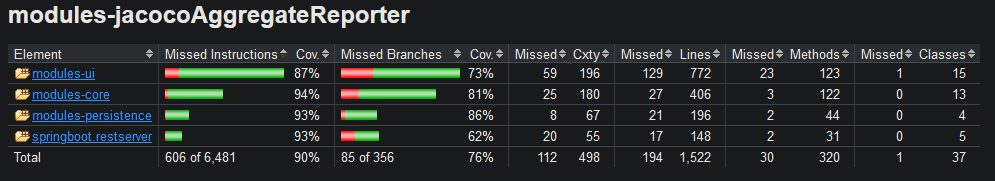

# Deliverable 3

## Application progress

## Test coverage
According to JaCoCo, our test coverage was at about 70% after the second deliverable. We have worked on improving this as much as possible. Some code branches are hard to get coverage for, since they are only executed in case of an error. We have tried to test these cases as well, but it is not always possible to get 100% coverage. Some other code makes no sense to test, i.e. the `main`-method in [`App`](/chore-manager/ui/src/main/java/ui/App.java) or the `main`-method in [`AppApplication`](/chore-manager/springboot/restserver/src/main/java/springboot/restserver/AppApplication.java). 

||
|:--:|
|Our final test coverage as reported by JaCoCo| 

When using JaCoCo, we learned that just looking at test coverage can be misleading. JaCoCo marks code as "covered" if it is run during the test phase. However, this does not mean that the code is explicitly tested. It might just be run as periphery code during another test. We have tried to avoid this issue by being aware of it and writing tests to explicitly test all the code we want to test. 

We did not have a test-driven approach, consequently most of our tests have been written after the implementations themselves. 

In each of our modules, we have used a `BaseTestClass` which all our other tests extend. This decision was made in order to avoid having a lot of boilerplate code in all of our test files. Amongst other things, this includes methods like `setTestEnvironment` that sets the test environment, and methods such as `deleteFile` or `clearItems` that resets the state of the application between tests. This base class was especially useful for ui tests, since they also included boilerplate for creating test persons and test collectives.

An issue we ran into when extending from the base class in the ui module, was when we wanted to override the setup method. Since the method was decorated with `@BeforeAll`, it had to be static - and we cannot override static methods. We were able to solve this by adding `@TestInstance(Lifecycle.PER_CLASS)` to the base class. This meant that `@BeforeAll`-methods did not have to be static and could be overridden. 