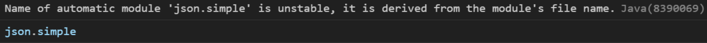

# Deliverable 3

## Application progress

## Test coverage
According to JaCoCo, our test coverage was at about 70% after the second deliverable. We have worked on improving this and get as close as possible to 100%. Some code branches are hard to get coverage for, since they are only executed in case of an error. We have tried to test these cases as well, but it is not always possible to get 100% coverage.

When using JaCoCo, we learned that just looking at test coverage can be misleading. JaCoCo marks code as "covered" if it is run during the test phase. However, this does not mean that the code is explicitly tested. It might just be run as periphery code during another test. We have tried to avoid this by being aware of it and writing tests that explicitly test all the code we want to test.

## Environments
We have introduced environments in release 3, which are used to isolate the configuration of the application. In total, we have two `.env`-files, one for each environment, which are [`.env.development`](/chore-manager/.env.development) and [`.env.test`](/chore-manager/.env.test). By introducing environments there is no way for the test environment to access the information used in the development environment, and vice versa. This solved a major concern regarding accidentally overwriting our main text file, with our test data, and we needed to be extremely careful to overwrite all file paths in tests. With environments, testing has no knowledge of the existence of the development environment, and therefore cannot overwrite it. Also by doing this, we automated the process of setting the file path, as the file path is defined in the `.env`-files.  

Although it is not recommended to push .env-files to GitLab, and instead share it confidentially within the team. We needed to push it to master, so that the app has the necessary information without needing to contact us when grading. In addition, our .env files do not contain any sensitive information.

## JSON in Java
In release 2, we used `JSON.simple`, which gave us a warning: 
Maven did not find the module if we specified an alternate path, therefore we decided to change our JSON library all together. We found [`JSON in Java`](https://mvnrepository.com/artifact/org.json/json) to be a more popular library, while the implementation was relativly similar to `JSON.simple`. By changing to this library, we got rid of the warning, with minimal code changes, this library also provided greater JSON support, which made building the REST API easier. 
We chose `JSON.simple`/`JSON in Java` because we thought that would cover all our use cases, at that time we did not know Spring Boot used Jackson to serialize/deserialize. Because of this, we could not use Spring Boot's automated JSON serialization/deserialization, and instead had to return plain Strings. In retrospect it would be better to utilize Jackson as our JSON library, which was better supported by Spring Boot.

## Changes in file classes
Previously we only had a `Storage` class, which contained all information about the application. Now we introduced a new class `State`, which holds information about the current state of the application. By that, I mean which person is logged in and the corresponding collective. By introducing this class we better uphold the Single Responsibility Principle. In addition, this made it easier to hide information about other collectives and users, which is important for security reasons. since we do not want to expose information about other users and collectives outside the collective the logged-in user in registered to. 

## CI/CD pipelines
In order to conform with best practices, we decided to protect the master branch. This means we remove the ability to direct push to the master branch, and instead have to go through merge requests. 

By doing this, we ensure the master branch is always in a working state.