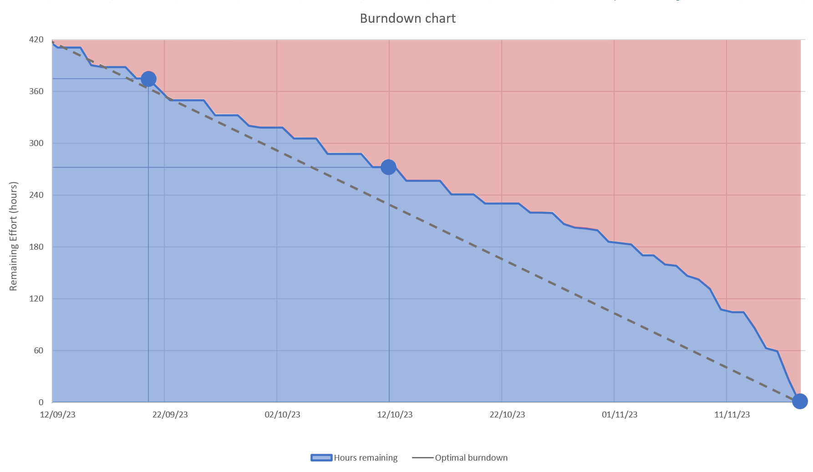

# Deliverable 3

## Application progress
**For deliverables 1 and 2, we implemented these user stories:**
- **"Lisa’s mid-mid-life crisis"**
- **Fading plants**
- **Jealousy, jealousy**

### Acceptance criteria for deliverable 3

Instead of creating a new client, we are going to implement more features.

**Complete:**
- ["Scoreboard"](../../UserStory.md)
- ["Popularity contest"](../../UserStory.md)
- ["Chopping down Christmas tree in july?"](../../UserStory.md)
- ["'Do(n't) put off until tomorrow what you can do today' - Benjamin Franklin"](../../UserStory.md)
- ["Spacetime"](../../UserStory.md)
- ["Detective"](../../UserStory.md)


**A user should be able to:**
- Receive the stated amount of points when having done a chore
	- The points will add up, and everyone in the group should be able to see the "scoreboard" (from **Scoreboard**)
- Create a group. Each group has its own calendar view, where the groups members can view their chores (from **Popularity contest**)
- The group should have a unique code, that can be passed around to roommates so that they can join the group when they first sign up (from **Popularity contest**)
- Delete chores (from **Chopping down christmas...**)
- Mark a chore as completed if completed (from **'Do(n't) put off until...**)
- If the chore is not completed within the time frame it is sat to, it should be pushed to the next day and marked as high priority. This could be achieved by changing the styling and marking it in red (from **'Do(n't) put off until...**)
- State how many weeks a chore should repeat in the chore-creation menu (from **Spacetime**)
- Create chores that can be done every day of the week (from **Spacetime**)
- View:
  - name of the chore
  - when the chore is overdue
  - the status of the chore
  - who the chore is assigned to 
  - how many points the chore is worth
  in a menu (from **Detective**)


### How far we got

We completed all the user stories, meaning we managed to finish the application. As we added features, we also realized that some quality of life (QOL) features were missing, such as "Go back" and "Log out" buttons as well as an easy way for members of a collective to spread the "collective code" around. These QOL features combined into the user story creatively named ["Quality of life"](../../UserStory.md).

We now have pages for:
 - Logging in
 - Creating users
 - Joining collectives
 - Creating collectives
 - The calendar
 - Creating chores
 - Viewing info about chores
 - The leaderboard

 ||
 |:--:|
 |Showcase of all pages|

## Description of the finished product

 ||
 |:--:|
 |State diagram for the application|

The figure above shows a state diagram of how the different pages interact. You start at the "Logging in" page. From there you can either log in to an existing user or create a brand new one by clicking "Create user" and filling in the details on the "Creating users" page. 

After creating a user, or logging in to a user that has not yet been assigned to a collective, you will be taken to the "Joining collectives" page. From here you can either choose to join a collective by typing in a code given to you by someone who has created a collective already or create a brand new collective by clicking the "Create collective" button and filling in the name of the collective.

Finally, you will be taken to the main page, "the calendar" page. From here you can log out again, by clicking "Log out", go to the leaderboard for your collective by clicking the "Leaderboard" button, copy your collectives code by clicking the "Code: [collective code]" button, or you can create chores. Create day-chores by clicking "Add" on a specific day, or create week-chores by clicking "Add" next to the number of the week you want to add a week-chore to. If you have created chores already, you can click on the created chores to view more info about them.

[Click here](../../chore-manager/README.md) for a more in depth description of how all scenes interact.

## Diversions from the original plan

 Overall we followed the plan for minimum viable product described in the graphic [presented in the readme of deliverable 1](../release1/README.md) closely, but made some diversions. These diversions were mainly in the name of consistency.

 ||
 |:--:|
 |Plan versus finished product|

 ||
 |:--:|
 |Plan versus finished product: here planned views are colored the same as their implemented counterparts|


The "Joining collectives" page and the "Creating collectives" page were initially planned to be just one page. However, as we made the pages for joining and creating collectives, we felt that the idea of creating a user and logging into a user, are ideas that each map to creating a collective and joining a collective. Therefore, since joining and creating a user were on separate pages, creating a collective and joining a collective should also be, for consistency. 

Moving the leaderboard from under the calendar, to its own page, was another diversion from the original plan. This was done to make the calendar page seem less overcrowded with features. The "Viewing info about chores" page was intended to just be a popup where you could mark a chore as done, however, we realized that we needed a way to display extra information, and because of that this also ended up being its own page. **The reasons we were able to add these extra pages were threefold.**

Firstly, we originally planned that the creation of week-chores (chores that can be done over a week), and the creation of day-chores (chores that need to be done on a specific day), should have their own pages. This ended up not being necessary as the only difference between a week-chore and a day-chore, is that day-chores have the same start and end date, while week-chores end-date are 7 days after their start date. Therefore they both got the same creation page. Therefore we saved a bit of time on that. 

Secondly, between deliverables 1 and 2, we created most "page-types" needed for the rest of the application. As visible in the overview of all pages, most pages follow a similar structure. Because of this, when we created new pages, we could use the already implemented pages as starting points. We could copy one of the old fxml-files, edit where needed, and pass it off as a new page. This saved us a lot of time. 

 ||
 |:--:|
 |Pages follow a clear structure|

Finally, the framework for going between pages made between deliverables 1 and 2 also saved us a lot of time. Instead of each controller having to define its own method for going from one page to another, which we had done up to that point, we instead followed the "Don't Repeat Yourself" (DRY) principle. We defined a static method in the App class in the UI that does this. We could then call this method from anywhere in the UI, and easily switch between scenes. This saved us a lot of time for this delivery, as we added a lot of buttons that take you from one page to another, such as the "Go back" buttons.

```java
public static void switchScene(String fxmlName) {
    try {
        FXMLLoader fxmlLoader = new FXMLLoader(App.class.getResource(fxmlName + ".fxml"));
        Parent parent = fxmlLoader.load();
        scene.setRoot(parent);
    } catch (IOException e) {
        System.out.println(e);
    }
}
```

Another diversion was a switch from weekly, recurring chores, to the ability to state how many weeks a chore should repeat. Weekly chores were tasks that were going to reoccur every week, until it was deleted by a user. We instead gave the user the ability to choose how many weeks a chore should repeat, as deletion should be reserved for when the user has done something wrong, like spelling a chore wrong or assigning the wrong person, and not be something a user is forced to in able to use the application. 

 ||
 |:--:|
 |The user can decide how many weeks a chore should repeat|

## Restructuring of fxml hierarchy
The fxml hierarchy over nodes for the calendar page grew substantially in size as new features were added. The main reason for this growth, was the addition of week chores, as they need to lay under every other day, as well as their own "Add" buttons, just like the day chores.

||
|:--:|
|A day chore and a week chore|

|||
|:--:|:--:|
|The old fxml hierarchy|The new fxml hierarchy|


## Refactoring in controllers

### The KISS and DRY principles
Since this is the last deliverable, alot of refactoring was done. As the fxml hierarchy for the calendar page grew, the controller for the page, the AppController, became longer. To conform with the "Keep It Simple, Stupid" (KISS) principle, we started extracting code into their own methods. Part of this was done up to deliverable 2, but the rest was done for deliverable 3. Now the initialize method almost exclusively contains method calls. By doing this we also conformed more to the DRY principle, as we could call these methods from other methods, instead of writing the same code twice. 

Below you can see the initialize method. Comments in the code have been removed to shorten it down.

```java
public void initialize() {
    this.dataAccess = App.getDataAccess();
    this.setCollectiveName();
    this.setTopColumn();
    this.weeks = this.createWeeks();
    this.handleScreenResizing();
    this.updateFxml();
    this.weekContainer.getChildren().add(this.subWeekScrollContainer);
    this.subWeekScrollContainer.setContent(this.subWeekContainer);
    this.consumeScroll();
}
```

### The model, view, controller principle
Refactoring in the model parts and additional refactoring in the controller parts of the project was needed to better conform to the model, view, controller principle. A lot of checks when creating accounts and chores were done by their respective controllers, CreateUserController and ChoreCreationController, in UI.  These checks could and should have been done by the respective classes that these controllers create. Therefore we added static isValid and getRequirements methods in both the Chore class and the RestrictedPerson class in core. These were used by the controllers to check inputs given by the users. 

## Environments / Isolation
We have introduced environments in release 3, which are used to isolate the configuration of the application. In total, we have two `.env`-files, one for each environment, which are [`.env.development`](/chore-manager/.env.development) and [`.env.test`](/chore-manager/.env.test). By introducing environments there is no way for the test environment to access the information used in the development environment, and vice versa. This solved a major concern regarding accidentally overwriting our main text file with our test data. Previously we needed to manually change the file paths in tests, if we failed to change the file path somewhere, we would overwrite our main text file with test data. With environments, testing has no knowledge of the existence of the development environment, and therefore cannot overwrite it. Also by doing this, we automated the process of choosing the file, as the file name is defined in the `.env`-files.  

Although it is not recommended to push .env-files to GitLab, and instead share it confidentially within the team. We needed to push it to the remote repository, so that the app has the necessary information without needing to contact us when grading. In addition, our .env files do not contain any sensitive information.

## JSON in Java
In release 2, we used `JSON.simple`, which gave us a warning: 
Maven did not find the module if we specified an alternate path, therefore we decided to change our JSON library all together. We found [`JSON in Java`](https://mvnrepository.com/artifact/org.json/json) to be a more popular library, while the implementation was relatively similar to `JSON.simple`. By changing to this library, we got rid of the warning, with minimal code changes, this library also provided greater JSON support, which made building the REST API easier. 
We chose `JSON.simple`/`JSON in Java` because we thought that would cover all our use cases, at that time we did not know Spring Boot used Jackson to serialize/deserialize. Because of this, we could not use Spring Boot's JSON serialization/deserialization, and instead had to return plain Strings. In retrospect it would be better to utilize Jackson as our JSON library, as it was better supported by Spring Boot.

Another change related to JSON, is that each class now has a static encode and decode method. This is used to convert the class to and from JSON, and is used when parsing the file. These methods handle exceptions appropriately. To assist us in converting `Strings` to `JSONObject` and `JSONArray`, we created a new class [`JSONValidator`](/chore-manager/core/src/main/java/core/json/JSONValidator.java).

## Changes in file classes
Previously we only had a `Storage` class, which contained all information about the application. Now we introduced a new class `State`, which holds information about the current state of the application. By that, I mean which person is logged in and the corresponding collective. By introducing this class we better uphold the Single Responsibility Principle. In addition, this made it easier to hide information about other collectives and users, which is important for security reasons, since we do not want to expose information about other users and collectives outside the collective the logged-in user is registered to. 

Since we have extended the functionality of the application, the JSON representation has also changed. Previously we had a list of `Persons`, but now we have a list of `Collectives`. Each `Collective` has a map of `Persons` with username as key. We have an empty collective called `LimboCollective`, which is used to temporarily hold users which has yet to be assigned to a collective.
There have been some changes in the attributes of each class, which would be to many too list, but some notable ones is: 
- Added collective
- Chores now a UUID
- Persons now have a hashed password
- Persons now have a unique username instead of UUID

The JSON representation of the data is as follows:
```json
[
    {
        "name": "The Almighty Collective",
        "joinCode": "465187",
        "persons": {
            "Christian": {
                "collectiveJoinCode": "465187",
                "password": "39a7067148acfa9987f856e9e996e6ac",
                "chores": [
                    {
                        "timeFrom": "2023-11-13",
                        "creator": "Christian",
                        "timeTo": "2023-11-13",
                        "color": "#FFFFFF",
                        "choreName": "Chore Test",
                        "checked": false,
                        "uuid": "ad1fc218-5a7b-4720-9e53-14c0558a42da",
                        "assignedTo": "Christian",
                        "points": 10,
                        "daysIncompleted": 0
                    }
                ],
                "displayName": "Christian",
                "username": "Christian"
            },
            "Kristoffer": {
                "collectiveJoinCode": "465187",
                "password": "8c137d328b81d693c3e95b24bebd31f4",
                "chores": [],
                "displayName": "Kristoffer",
                "username": "Kristoffer"
            },
            "Lasse": {
                "collectiveJoinCode": "465187",
                "password": "b7afbba14a9e6b51e7a8b6054f9a114c",
                "chores": [],
                "displayName": "Lasse",
                "username": "Lasse"
            },
            "Sebastian": {
                "collectiveJoinCode": "465187",
                "password": "42f749ade7f9e195bf475f37a44cafcb",
                "chores": [],
                "displayName": "Sebastian",
                "username": "Sebastian"
            }
        }
    },
    {
        "name": "Limbo Collective",
        "joinCode": "000000",
        "persons": {}
    },
    {
        "name": "New Collective",
        "joinCode": "793978",
        "persons": {
            "TestUser": {
                "collectiveJoinCode": "793978",
                "password": "b251e8bdeed0c7137bb9d72ece6e1568",
                "chores": [
                    {
                        "timeFrom": "2023-11-14",
                        "creator": "TestUser",
                        "timeTo": "2023-11-14",
                        "color": "#334DB3",
                        "choreName": "Ta ut av oppvaskmaskinen",
                        "checked": false,
                        "uuid": "7902f9f0-a4b2-4115-9a65-b6b04ec95f76",
                        "assignedTo": "TestUser",
                        "points": 60,
                        "daysIncompleted": 0
                    },
                    {
                        "timeFrom": "2023-11-16",
                        "creator": "TestUser",
                        "timeTo": "2023-11-16",
                        "color": "#FFFFFF",
                        "choreName": "Ta ut søpla",
                        "checked": false,
                        "uuid": "50dd48b6-133c-46ad-bbd8-bda8de938c78",
                        "assignedTo": "TestUser",
                        "points": 10,
                        "daysIncompleted": 0
                    }
                ],
                "displayName": "TestUser",
                "username": "TestUser"
            }
        }
    }
]
```

## CI/CD pipelines
In order to conform with best practices, we decided to protect the `master` branch. This means we removed the ability to directly push to the `master` branch, and instead have to go through merge requests. Following this change, we introduced continuous integration and continuous delivery (CI/CD) pipelines. The pipeline is only triggered on merge requests, and it will run certain maven commands. The pipeline will run the following commands:
- `mvn compile` - Installs the necessary dependencies.
- `mvn test -DskipUITests` - Runs all tests in core, persistence and springboot.
- `mvn clean install -DskipTests` - Runs everything, including Spotbugs, Checkstyle, JavaDocs and JaCoCo

If any of these commands fail, the pipeline will fail, and the merge request will not be allowed to merge. This ensures that the `master` branch is always in a working state, and that no unforeseen bugs are introduced. The pipeline is divided into stages accordingly, with three different stages: `build`, `test` and `install`, with their own seperate resonsibility. However, the pipeline does not run tests in the UI package as the pipeline fails to run the JavaFX application and render the GUI. To conclude, the pipeline has successfully identified bugs and test-fails in our code and has helped us produce a more stable application and keep master in a working state.

## REST API
In this release we needed to create a REST API. The API has endpoints for each of the CRUD (Create, Read, Update, Delete) operations, where we respectively use the HTTP Methods POST, GET, PUT, DELETE. As a result of the REST API, no classes in the UI-package uses `Storage` or `State` methods/data directly, but instead gets all information through `DataAccess`. 

 ||
 |:--:|
 | This package diagram shows the architecture of our application after implementing the REST API |

Note:
At the time of writing this documentation, we noticed the REST API is not stateless. This means the API stores information about the authorized user, which should instead be provided on each request. Our `StateController` stores the currently logged in user, which should instead be handled by the frontend. Although our API would conform better with the REST standard if it was stateless, we have decided to leave it as is. This is because it would require a lot of development time and code changes in order to make our REST API stateless, and other issues are more pressing. In addition, it is not a requirement for this course to have a stateless REST API, so we kept the stateful REST API which uses the state as authorization.
It would not be difficult to make our API stateless, but it would take a lot of time, here is a list of changes which would need to be made:
- Move `State` to UI, and store the currently logged in user there.
- Remove all methods in `State` which manipulates data and move them into `Storage`.
- Remove `StateController` and move most methods into `StorageController`.
- Send the username and password on each request.
- Create a method in backend which checks if the username and password finds a match, then use this information to decide if the user is authorized to perform this request or not.
- Rewrite all API tests and some UI tests.
- Now the API would be stateless, as it would not store any information about the client.

#### Format
We utilize two different controllers, each associated with its respective context path: `storage/` and `state/`, which correspond to the `Storage` and `State` classes. This makes it easier to understand the endpoints, and makes it easier to find the endpoints you are looking for. This means if you want to do something about that is relevant to the currently logged in collective, you would use the `state/` endpoints. An example is `POST: chores/{uuid}` which creates a new chore in the currently logged in collective. As this is relevant to the current collective, we use `state/`. However creating a new person, does not depend on the currently logged in collective (as we have not logged into any collective yet), and therefore we use `storage/` as the endpoint.

Our endpoints does not use verbs, like `getPerson`, `addPerson` or `movePerson`, but instead uses nouns, like `GET persons/{uuid}`, `POST persons/{uuid}` and `PUT persons/{uuid}`, where `GET`, `POST` and `PUT` are HTTP methods. The reason for not needing verbs is because the HTTP methods already specify the action, and therefore there is no need to explicitly specify it in the endpoint.

The format for a request should be as follows:
```
(HTTP-METHOD) baseurl/context-path/path?query-parameters
(YOUR-HEADERS)
```

Here is an example of an API request, which gets your user information:
```
GET /storage%2Fpersons%2FLasse?password=39a7067148acfa9987f856e9e996e6ac
Host: http://localhost:8080
Accept: application/json
Content-Type: application/x-www-form-urlencoded
```

The final URI looks like this:
```
http://localhost:8080/storage%2Fpersons%2FLasse?password=39a7067148acfa9987f856e9e996e6ac
```

Here is the example of the response from the API request above (formatted from a `HttpResponse`-object):
```json
{
    "status":200,
    "Content-Type": "application/json",
    "body": {"collectiveJoinCode":"465187","password":"39a7067148acfa9987f856e9e996e6ac","chores":[],"displayName":"Lasse","username":"Lasse"},
}
```

Some endpoints also require a body to be sent in the request. For example `POST storage/persons/{username}` which adds the user defined in the body.

### Fetching

One thing to be careful about when building an API is to avoid over-fetching. We could in practice have a method which gets all collectives (which contains all information about persons and chores), then cache it, then never need to perform another GET request (until data is invalidated with a POST, PUT or DELETE request), but this is considered bad practice. If we were to do this, we would fetch information that we would never need, like information about other collectives which you are not a part of. Another massive issue with a solution like that, would be that we would return data that the user should not have access to, like other users' passwords. We instead made sure to make endpoints which returns only the information that is needed, and the user should not get access to any information that is not relevant to them. This is done by having multiple smaller endpoints, instead of one large which returns everything. To give an example `getAllCollectives`-endpoint got turned into `getCollective`-, `getPerson`- and `getChores`-endpoints.

### Caching

Caching is essential in reducing server load and latency. By caching frequently accessed data, we can reduce the time the server has to spend on processing a request. In our API we have used Spring Boot's inbuilt caching implementation, which is applied with the `@Cacheable`-annotation. In addition we can invalidate data with `@CacheEvict`, when we alter the corresponding data. Because we are using Spring Boot's implementation in the back-end, it is the server which caches the data, and not the client (server-side caching). 
In practice, our application would benefit better from client-side caching, as most of our endpoints have a relatively low time complexity, and it is the actual sending/receiving which accounts for most of the round-trip time. As server-side caching was supported by Spring Boot, we decided to use it, and as we already had a caching implementation in the back-end, we thought development time was better spent elsewhere than implementing client-side caching.

### Sensitive information

Our API hides sensitive information from the user, unless it is information about the authorized user itself (e.g. when logging in). This is done by creating a restricted class which does not have sensitive attributes (See [`RestrictedPerson`](/chore-manager/core/src/main/java/core/data/RestrictedPerson.java) and [`RestrictedCollective`](/chore-manager/core/src/main/java/core/data/RestrictedCollective.java)). An example is when getting a collective, we return a `RestrictedCollective`-instance, which does not have any attributes for persons in the collective, and therefore does not expose sensitive information about them. The same applies for `RestrictedPerson`, which does not have any attributes for password, which means you only get information about the username and display name.  

In addition, all validation and checking is done in the back-end, to not expose any sensitive information to the user. 
For-example when checking trying to log in, we don't call a method which returns all users, then check if the logging information match any of those. Instead we have a method in the back-end, which takes in the username and password, and checks if it matches any of the users, then returns only that user.

## Refactor of `Password` class

In release 2, our `Password` class stored the password in clear text. In order to improve security we decided to use a one-way MD5 hash function. This means we can store the hash, and not the actual password. Our application only uses the original password to generate the hash, then that string is discarded. This means that if someone read our JSON file, they would not get the actual password, but just the hash. This is a major improvement in security, as it is much harder to crack a hash than clear text.

We also decided to refactor the `Password` class to better follow best practices and design patterns. We now have three classes related to Password, [`Password`](/chore-manager/core/src/main/java/core/data/Password.java), [`PasswordValidator`](/chore-manager/core/src/main/java/core/data/PasswordValidator.java), [`PasswordValidatorBuilder`](/chore-manager/core/src/main/java/core/data/PasswordValidatorBuilder.java).
By splitting `Password` into three classes, we conform better with the single responsibility principle. `Password` now manages the password, `PasswordValidator` validates the password, and `PasswordValidatorBuilder` builds the validation rules. This helps in maintaining and modifying the code without affecting unrelated functionalities.
We have taken the Builder design pattern into use, which creates a `PasswordValidator`-object with the rules specified in the `PasswordValidatorBuilder`. This makes it easier to create a `PasswordValidator`-instance, as you do not need to specify all the rules in the constructor, but instead can add them one by one. This also makes it easier to add new rules, as you do not need to change the constructor, but instead add a new method in the `PasswordValidatorBuilder`, which conforms with the Open/Closed Principle.

## JLink and JPackage

We added support for JLink and JPackage in order to make the application shippable. This means that we can create a custom runtime image, which contains the application and all its dependencies. The runtime image can then be distributed to users, and they can run the application without having to install Java. This is a major improvement in usability, as the user does not need to install Java, and can instead just run the application.

A drawback when using Windows is that you also have to install the [Wix Toolset](https://wixtoolset.org/), which is used to create the installer. This is because JPackage does not support creating installers for Windows, and therefore we have to use Wix Toolset to create the installer. This is not an issue on Linux, as JPackage supports creating installers for Linux.

Another important thing to note is that the Spring Boot server has to run in the background in order for the shipped application to work. This is because the frontend of the application relies on API to fetch application data.

## Time tracking

For tracking time spent, we organized an Excel spreadsheet, where each team member enter a row for what they have done.
Below is a screenshot of parts of the spreadsheet:


A visual representation of our project's progress can be found in the burndown chart below. Each blue dot corresponds to a completed deliverable, providing a quick overview of how our time was spent. As you can see, our time spent increased significantly in the last stage of the project. This is due to the fact that it took longer than planned to develop a robust REST API, a crucial component which numerous other components depended on. Due to this dependency, certain components had to be postponed until the completion of the REST API. Another aspect that took longer than expected was the addition of JLink and JPackage.

 ||
 |:--:|
 | Burndown chart for hours spent working on this project. The blue dots represent a deliverable. |


Time spent on each deliverable (all 4 team members combined):
| Deliverable | Hours | Total days in deliverable | Hours per day |
| -----------:| -----:| -------------------------:| -------------:|
| 1           |  58   | 11 days                   | 5.28          |
| 2           |  90   | 22 days                   | 4.09          |
| 3           |  272  | 36 days                   | 7.56          |
| **Total**   |  **420**  | **69 days**           | **6.09**      |


In our group contract we agreed to spend 4 hours on meetings and 3 hours independently each week, in total 7 hours per team member on our project. Given that the project spanned 10 weeks, our initial time estimate amounted to 280 hours. Originally, we anticipated spending 4 hours weekly on lectures, bringing the total time allocated to this subject to 11 hours per week. However, when the lectures stopped midway through the semester, we adjusted our strategy. This allowed us to extends our meetings by an additional 4 hours. Our projection for time spent on the project consequently increased to 400 hours. As you can see from the table above, we spent 420 hours on the project, which is 20 hours more than our initial projection, which isn't so far off considering the scope of the project.


## Workflow 

### General Workflow
In the last stage of our project, a bit has changed when it comes to our general workflow. As before, we have continued holding two meetings a week. As the deadline has approached these meetings have gotten longer and longer, in order to finish our application on time before the deadline. As with deliverable 2, we started this last stage by looking at the feedback we had received from the previous deliverable, before starting to look at the requirements for deliverable 3. During our last deliverable we have made greater use of pair-programming, and agile methods like the Scrum framework, which we will come back to. 

### Issues
For this last deliverable, we have created issues according to the feedback we received from the previous deliverable. This has helped us deal with these issues in a structured and orderly manner. Next, we started making issues with the requirements for deliverable 3. Making every issue as concrete as possible with a well-defined scope, making it as easy as possible for the developer to deal with. Furthermore, we have made sure that every issue is dealt with in accordance with the issues level of importance. Most issues have been marked with a label stating the importance and degree of urgency, always making it clear what issues should be the top priority. 


### Branching
We have continued to use branching diligently throughout the project until the end. This last deliverable is no exception. As with previous deliverables we have used the same strategy when it comes to branching. This is described in the first deliverable and the [Developer Guide](/DEVELOPER_GUIDE.md). Our master branch houses our production-ready code, and each issue is branched out from master into their own separate branch. By working on separate branches it becomes easier to maintain the correct changes while minimizing the risk of overwriting each other by accident. We have continued to adopt the same good practices as with previous deliverables. This includes: 

- Creating merge requests when an issue is finished, having at least one team member review and approve the code before being able to merge with `master`.

- Strict naming convention: `{issue-number}-name-of-branch`. 

This is also documented in [Developer guide](/DEVELOPER_GUIDE.md). 

We have adopted to small and frequent commits, which has helped in tracking changes and easier identifying when and why a particular change was made.
When merging to the master branch, we choose to keep the history from the branches (merge commits). The alternative would be to squash our commits into a single commit, which do provide a shorter and cleaner history, but also loses context, and it becomes more difficult to identify introductions of bugs as the history is condensed.


### Milestones
As with previous deliverables we have created milestones for the project. These milestones have been used to group issues together. By grouping issues together it becomes easier to prioritize and filter issues based on their relevance and importance to the final goal of the milestone. The milestones act as a deadline, and help us with time-based planning. It also allows us to quickly assess the overall status of a milestone, and how much remains to be done. This has been a useful tool for us, and has helped us stay on track and meet our deadlines.


### Pair-programming
Pair programming has become a notable part of our approach, especially towards the end of the project. As the project grew in size, the development of new features and debugging became increasingly complex. Gradually adopting more and more pair-programming has helped us effectively tackle these complexities and issues. This method has not only improved the overall quality of our code but also streamlined the problem-solving process. By working closely together, we have been able to quickly share insights and alternate perspectives, leading to better solutions and quicker fixes. Additionally, this approach has significantly reduced the occurrence of bugs and errors, ensuring a more reliable and robust end product.

### Agile methods
Agile methods have gradually become a more significant part of our workflow. As the project has gotten bigger, and more time is spent working outside the set meetings, we've found that Agile practices, particularly Scrum, enhance our flexibility and responsiveness to change. Implementing Scrum has brought structure and clarity to our process, with regular sprints and sprint planning meetings ensuring that we are always working towards well-defined goals. While daily stand-ups for obvious reasons has not been a part of our project, we have implemented a simplified version of the Scrum framework:

- In our project, we've embraced a flexible approach to Scrum, adapting its roles and processes to fit our team's workflow. For roles like the Product Owner and Scrum Master, we've opted for a collaborative approach rather than assigning them to specific individuals. This has encouraged a sense of shared responsibility and made a more inclusive decision-making process.

- Product Backlog: We created lists of user stories consisting of features that could potentially go into the product. This list has evolved throughout the project and each item is prioritized based on its importance and impact on the project.

- Sprint backlog: The user stories with the highest priority (in other words the feature we decide we want to implement) goes into the sprint backlog. These are the tasks we aim to in the upcoming sprint. 

- Daily (Weekly) Scrum: These have been held during our weekly meetings. Three main talking points in the weekly scrum, aka standup-meetings:
- What I did since our last meeting
- What I plan to work on today and until our next meeting
- Any impediments or blockers

The latter is arguably the most important. In this part, team members communicate any obstacles or challenges they are facing that may hinder their progress. Examples include dependencies on other team members or technical issues. By talking about the obstacle, the team can quickly identify and share knowledge to address the issue, which reduces the amount of time a team members stays stuck on a problem.

- Sprint: A sprint typically lasts for 1-4 weeks, meaning each deliverable could be viewed as a sprint. 

All the above steps combined describe how we have implemented a "Scrum light" framework. It offers the structured framework of traditional Scrum, yet provides the adaptability we needed given the fact that this is a school-project. This method has both improved our project management and also enhanced team collaboration and efficiency.


### Communication
Our team did not suffer from communication issues, and because of this, we never had multiple team member accidentally working on the same issue, producing duplicate work. Since we communicated effectively, we were also very aware of merge conflicts. We knew when certain merge conflicts would emerge, and therefore planned accordingly to ensure both team members were present to discuss which changes to keep.

### Code-quality
In regards to our code-quality a lot has stayed the same. We still have the automatic formatter which uses RedHat's default formatting settings. The code is formatted automatically on save, this helps to keep the code style consistent, and makes the development easier, as the developer has less things on their mind. In addition to the formatter, we have also setup other actions to be performed on save:
- `organizeImports` (add imports + reorganize import order)
- `qualifyMembers` (automatically add `this` on attributes)
- `addOverride` (automatically add `@Override` to methods that override a superclass method)

For more information about linters see [release2's README](/docs/release2/README.md).

We have also extensively followed best practices in Java, you can see some of them in the [Developer Guide](/DEVELOPER_GUIDE.md). 
To ensure a consistent code structure we continue using the MVC-principle, which means that the model, view and controller are separated.

We also ensure to always comment and document our code, so that the next person who reads the code can quickly understand it. This has been very beneficial for the internal workflow within the group, but it also makes makes it a lot easier for outsiders to view and understand the code that we have written. Not only does this make the process of evaluating and giving feedback on the project a lot easier, it also makes going back to the project in the future a lot easier. One scenario could be that we at a later point want to continue to the develop the application with new features. This might be with the existing team, but also with new team members. In any case, having code with well structured commenting and documentation makes it a lot easier. 

Another important aspect of the code quality is the naming of functions, variables, classes etc. Utilizing a consistent naming convention with descriptive names can be equally beneficial in order to read and understand the code. 

As mentioned before, in order to merge to the master branch, we have required at least one other team member to review the code. This has made it a lot easier to spot anti-patterns and suggest better alternatives. Overall this has been a huge contribution to our code-quality and has probably saved us lots of work by not having to refactor code at a later stage. Spotting bugs and potential errors before production is something we strive to achieve. 


### In retrospect

Reflecting on our project, the disciplined yet flexible workflow has been crucial to our project. Embracing agile methodologies, especially a tailored Scrum framework, optimized project management and helped us keep the process as sturctured as possible. The adoption of pair-programming in later stages significantly enhanced code quality and problem-solving efficiency when things got more complicated.

Our systematic approach to addressing feedback and prioritizing issues helped us minimize problems and enhancing overall efficiency. Consistantly prioritizing code quality through formatting, commenting and documentation established a robus foundation for potential future development and maintenance. 

In conclusion, this project has been valuable learning experience, teaching us about the importance of adaptability, good planning and teamwork when working on a development project like this. The experience and skills we have developed will most certainly benefit us in the future. 


# Other documentation
- Test coverage is documented in the [tests.md](tests.md) file.
- Diagrams are documented in the [diagrams.md](diagrams.md) file.

