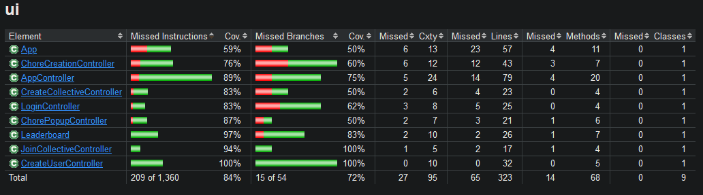
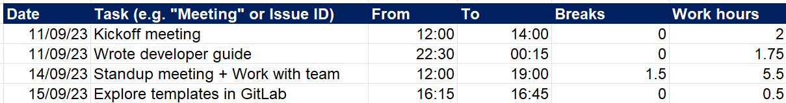

# Deliverable 3

## Application progress
**For deliverables 1 and 2, we implemented these user stories:**
- **"Lisa’s mid-mid-life crisis"**
- **Fading plants**
- **Jealousy, jealousy**

### Acceptance criteria for deliverable 3

Instead of creating a new client, we are going to implement more features.

**Complete:**
- ["Scoreboard"](../../UserStory.md)
- ["Popularity contest"](../../UserStory.md)
- ["Chopping down Christmas tree in july?"](../../UserStory.md)
- ["'Do(n't) put off until tomorrow what you can do today' - Benjamin Franklin"](../../UserStory.md)
- ["Spacetime"](../../UserStory.md)
- ["Detective"](../../UserStory.md)


**A user should be able to:**
- Receive the stated amount of points when having done a chore
	- The points will add up, and everyone in the group should be able to see the "scoreboard" (from **Scoreboard**)
- Create a group. Each group has its own calendar view, where the groups members can view their chores (from **Popularity contest**)
- The group should have a unique code, that can be passed around to roommates so that they can join the group when they first sign up (from **Popularity contest**)
- Delete chores (from **Chopping down christmas...**)
- Mark a chore as completed if completed (from **'Do(n't) put off until...**)
- If the chore is not completed within the time frame it is sat to, it should be pushed to the next day and marked as high priority. This could be achieved by changing the styling and marking it in red (from **'Do(n't) put off until...**)
- State how many weeks a chore should repeat in the chore-creation menu (from **Spacetime**)
- Create chores that can be done every day of the week (from **Spacetime**)
- View:
  - name of the chore
  - when the chore is overdue
  - the status of the chore
  - who the chore is assigned to 
  - how many points the chore is worth
  in a menu (from **Detective**)


### How far we got

We completed all the user stories, meaning we managed to finish the application. As we added features, we also realized that some quality of life (QOL) features were missing, such as "Go back" and "Log out" buttons as well as an easy way for members of a collective to spread the "collective code" around. These QOL features combined into the user story creatively named ["Quality of life"](../../UserStory.md).

We now have pages for:
 - Logging in
 - Creating users
 - Joining collectives
 - Creating collectives
 - The calendar
 - Creating chores
 - Viewing info about chores
 - The leaderboard

 ||
 |:--:|
 |Showcase of all pages|

## Description of the finished product

 ||
 |:--:|
 |State diagram for the application|

The figure above shows a state diagram of how the different pages interact. You start at the "Logging in" page. From there you can either log in to an existing user or create a brand new one by clicking "Create user" and filling in the details on the "Creating users" page. 

After creating a user, or logging in to a user that has not yet been assigned to a collective, you will be taken to the "Joining collectives" page. From here you can either choose to join a collective by typing in a code given to you by someone who has created a collective already or create a brand new collective by clicking the "Create collective" button and filling in the name of the collective.

Finally, you will be taken to the main page, "the calendar" page. From here you can log out again, by clicking "Log out", go to the leaderboard for your collective by clicking the "Leaderboard" button, copy your collectives code by clicking the "Code: [collective code]" button, or you can create chores. Create day-chores by clicking "Add" on a specific day, or create week-chores by clicking "Add" next to the number of the week you want to add a week-chore to. If you have created chores already, you can click on the created chores to view more info about them.

[Click here](../../chore-manager/README.md) for a more in depth description of how all scenes interact.

## Diversions from the original plan

 Overall we followed the plan for minimum viable product described in the graphic [presented in the readme of deliverable 1](../release1/README.md) closely, but made some diversions. These diversions were mainly in the name of consistency.

 ||
 |:--:|
 |Plan versus finished product|

 ||
 |:--:|
 |Plan versus finished product: here planned views are colored the same as their implemented counterparts|


The "Joining collectives" page and the "Creating collectives" page were initially planned to be just one page. However, as we made the pages for joining and creating collectives, we felt that the idea of creating a user and logging into a user, are ideas that each map to creating a collective and joining a collective. Therefore, since joining and creating a user were on separate pages, creating a collective and joining a collective should also be, for consistency. 

Moving the leaderboard from under the calendar, to its own page, was another diversion from the original plan. This was done to make the calendar page seem less overcrowded with features. The "Viewing info about chores" page was intended to just be a popup where you could mark a chore as done, however, we realised that we needed a way to display extra information, and because of that this also ended up being its own page. **The reasons we were able to add these extra pages were threefold.**

Firstly, we originally planned that the creation of week-chores (chores that can be done over a week), and the creation of day-chores (chores that need to be done on a specific day), should have their own pages. This ended up not being necessary as the only difference between a week-chore and a day-chore, is that day-chores have the same start and end date, while week-chores end-date are 7 days after their start date. Therefore they both got the same creation page. Therefore we saved a bit of time on that. 

Secondly, between deliverables 1 and 2, we created most "page-types" needed for the rest of the application. As visible in the overview of all pages, most pages follow a similar structure. Because of this, when we created new pages, we could use the already implemented pages as starting points. We could copy one of the old fxml-files, edit where needed, and pass it off as a new page. This saved us a lot of time. 

 ||
 |:--:|
 |Pages follow a clear structure|

Finally, the framework for going between pages made between deliverables 1 and 2 also saved us a lot of time. Instead of each controller having to define its own method for going from one page to another, which we had done up to that point, we instead followed the "Don't Repeat Yourself" (DRY)principle. We defined a static method in the App class in the UI that does this. We could then call this method from anywhere in the UI, and easily switch between scenes. This saved us a lot of time for this delivery, as we added a lot of buttons that take you from one page to another, such as the "Go back" buttons.

```java
public static void switchScene(String fxmlName) {
    try {
        FXMLLoader fxmlLoader = new FXMLLoader(App.class.getResource(fxmlName + ".fxml"));
        Parent parent = fxmlLoader.load();
        scene.setRoot(parent);
    } catch (IOException e) {
        System.out.println(e);
    }
}
```

Another diversion was a switch from weekly, recurring chores, to the ability to state how many weeks a chore should repeat. Weekly tasks were tasks that were going to reoccur every week, until it was deleted by a user. We instead gave the user the ability to choose how many weeks a chore should repeat, as deletion should be reserved for when the user has done something wrong, like spelling a chore wrong or assigning the wrong person, and not be something a user is forced to in able to use the application. 

 ||
 |:--:|
 |The user can decide how many weeks a chore should repeat|
 

## Test coverage
According to JaCoCo, our line coverage was at 77% and our branch coverage was at 55% after the second deliverable. We have worked on improving our coverage as much as possible. However, some code branches are hard to get coverage for, since they are only executed in case of an error. We have tried to test these cases as well, but it is not always possible to get 100% coverage. There is also some code that makes no sense to test, i.e. the `main`-method in [`App`](/chore-manager/ui/src/main/java/ui/App.java) or the `main`-method in [`AppApplication`](/chore-manager/springboot/restserver/src/main/java/springboot/restserver/AppApplication.java). 

|||
|:--:|:--:|
|Our test coverage after deliverable 2 as reported by JaCoCo|Our final test coverage as reported by JaCoCo| 

|||
|:--:|:--:|
|Our test coverage in [ui](../../chore-manager/ui/src/main/java/ui/) after deliverable 2 as reported by JaCoCo|Our final test coverage in [ui](../../chore-manager/ui/src/main/java/ui/) as reported by JaCoCo| 

Even though our line coverage only increased from 77% to 90%, the amount of code (both lines and branches) in the project has increased by a lot. The total amount of lines and branches has more than doubled since deliverable 2. The amount of lines we test increased from 1849 -> 5875 (217% increase) and the amount of branches we test increased from 66 -> 271 (310% increase). We also test the UI a lot more thoroughly now. Previously our tests did not have very good branch coverage (40%), but now we have reached 72%. This reflects our renewed focus on ensuring that the application has a proper test suite, as well as a more test-driven approach to development.

When using JaCoCo, we learned that just looking at test coverage can be misleading. JaCoCo marks code as "covered" if it is run during the test phase. However, this does not mean that the code is explicitly tested. It might just be run as periphery code during another test. We have tried to avoid this issue by (1) being aware of it and (2) writing tests to explicitly test all the code we want to test. 

In accordance to the DRY (Don't repeat yourself) principle, we have used a `BaseTestClass` which all our other tests extend. This decision was made in order to avoid having a lot of boilerplate code in all of our test classes. Amongst other things, this includes methods like `setTestEnvironment` that sets the test environment, and methods such as `deleteFile` or `clearItems` that resets the state of the application between tests. This base class was especially useful for ui tests, since these tests also include boilerplate for handling the view as well as creating test persons and test collectives.

An issue we ran into when extending from the [base class in the ui module](../../chore-manager/ui/src/test/java/ui/BaseTestClass.java), was when we wanted to override the `setup` method. Since `setup` was used in static methods (decorated with `@BeforeAll`) it also had to be static - and we cannot override static methods. A possible solution to this was by adding `@TestInstance(Lifecycle.PER_CLASS)` to the base class. This meant that `@BeforeAll`-methods did not have to be static and could be overridden. We did not do this, the main reason being that the state of the test class would persist between tests. Our tests have been made with the assumption that the state resets between tests, meaning we would see unexpected behavior if we were to suddenly change this. The solution we went for was instead to change the extending class so it did not have to be override the `setup`-method.

## Environments / Isolation
We have introduced environments in release 3, which are used to isolate the configuration of the application. In total, we have two `.env`-files, one for each environment, which are [`.env.development`](/chore-manager/.env.development) and [`.env.test`](/chore-manager/.env.test). By introducing environments there is no way for the test environment to access the information used in the development environment, and vice versa. This solved a major concern regarding accidentally overwriting our main text file with our test data. Previously we needed to manually change the file paths in tests, if we failed to change the file path somewhere, we would overwrite our main text file with test data. With environments, testing has no knowledge of the existence of the development environment, and therefore cannot overwrite it. Also by doing this, we automated the process of choosing the file, as the file name is defined in the `.env`-files.  

Although it is not recommended to push .env-files to GitLab, and instead share it confidentially within the team. We needed to push it to the remote repository, so that the app has the necessary information without needing to contact us when grading. In addition, our .env files do not contain any sensitive information.

## JSON in Java
In release 2, we used `JSON.simple`, which gave us a warning: 
Maven did not find the module if we specified an alternate path, therefore we decided to change our JSON library all together. We found [`JSON in Java`](https://mvnrepository.com/artifact/org.json/json) to be a more popular library, while the implementation was relatively similar to `JSON.simple`. By changing to this library, we got rid of the warning, with minimal code changes, this library also provided greater JSON support, which made building the REST API easier. 
We chose `JSON.simple`/`JSON in Java` because we thought that would cover all our use cases, at that time we did not know Spring Boot used Jackson to serialize/deserialize. Because of this, we could not use Spring Boot's JSON serialization/deserialization, and instead had to return plain Strings. In retrospect it would be better to utilize Jackson as our JSON library, as it was better supported by Spring Boot.

Another change related to JSON, is that each class now has a static encode and decode method. This is used to convert the class to and from JSON, and is used when parsing the file. These methods handle exceptions appropriately. To assist us in converting `Strings` to `JSONObject` and `JSONArray`, we created a new class [`JSONValidator`](/chore-manager/core/src/main/java/core/json/JSONValidator.java).

## Changes in file classes
Previously we only had a `Storage` class, which contained all information about the application. Now we introduced a new class `State`, which holds information about the current state of the application. By that, I mean which person is logged in and the corresponding collective. By introducing this class we better uphold the Single Responsibility Principle. In addition, this made it easier to hide information about other collectives and users, which is important for security reasons, since we do not want to expose information about other users and collectives outside the collective the logged-in user is registered to. 

Since we have extended the functionality of the application, the JSON representation has also changed. Previously we had a list of `Persons`, but now we have a list of `Collectives`. Each `Collective` has a map of `Persons` with username as key. We have an empty collective called `LimboCollective`, which is used to temporarily hold users which has yet to be assigned to a collective.
There have been some changes in the attributes of each class, which would be to many too list, but some notable ones is: 
- Added collective
- Chores now a UUID
- Persons now have a hashed password
- Persons now have a unique username instead of UUID

The JSON representation of the data is as follows:
```json
[
    {
        "name": "The Almighty Collective",
        "joinCode": "465187",
        "persons": {
            "Christian": {
                "collectiveJoinCode": "465187",
                "password": "39a7067148acfa9987f856e9e996e6ac",
                "chores": [
                    {
                        "timeFrom": "2023-11-13",
                        "creator": "Christian",
                        "timeTo": "2023-11-13",
                        "color": "#FFFFFF",
                        "choreName": "Chore Test",
                        "checked": false,
                        "uuid": "ad1fc218-5a7b-4720-9e53-14c0558a42da",
                        "assignedTo": "Christian",
                        "points": 10,
                        "daysIncompleted": 0
                    }
                ],
                "displayName": "Christian",
                "username": "Christian"
            },
            "Kristoffer": {
                "collectiveJoinCode": "465187",
                "password": "8c137d328b81d693c3e95b24bebd31f4",
                "chores": [],
                "displayName": "Kristoffer",
                "username": "Kristoffer"
            },
            "Lasse": {
                "collectiveJoinCode": "465187",
                "password": "b7afbba14a9e6b51e7a8b6054f9a114c",
                "chores": [],
                "displayName": "Lasse",
                "username": "Lasse"
            },
            "Sebastian": {
                "collectiveJoinCode": "465187",
                "password": "42f749ade7f9e195bf475f37a44cafcb",
                "chores": [],
                "displayName": "Sebastian",
                "username": "Sebastian"
            }
        }
    },
    {
        "name": "Limbo Collective",
        "joinCode": "000000",
        "persons": {}
    },
    {
        "name": "New Collective",
        "joinCode": "793978",
        "persons": {
            "TestUser": {
                "collectiveJoinCode": "793978",
                "password": "b251e8bdeed0c7137bb9d72ece6e1568",
                "chores": [
                    {
                        "timeFrom": "2023-11-14",
                        "creator": "TestUser",
                        "timeTo": "2023-11-14",
                        "color": "#334DB3",
                        "choreName": "Ta ut av oppvaskmaskinen",
                        "checked": false,
                        "uuid": "7902f9f0-a4b2-4115-9a65-b6b04ec95f76",
                        "assignedTo": "TestUser",
                        "points": 60,
                        "daysIncompleted": 0
                    },
                    {
                        "timeFrom": "2023-11-16",
                        "creator": "TestUser",
                        "timeTo": "2023-11-16",
                        "color": "#FFFFFF",
                        "choreName": "Ta ut søpla",
                        "checked": false,
                        "uuid": "50dd48b6-133c-46ad-bbd8-bda8de938c78",
                        "assignedTo": "TestUser",
                        "points": 10,
                        "daysIncompleted": 0
                    }
                ],
                "displayName": "TestUser",
                "username": "TestUser"
            }
        }
    }
]
```

## CI/CD pipelines
In order to conform with best practices, we decided to protect the `master` branch. This means we removed the ability to directly push to the `master` branch, and instead have to go through merge requests. Following this change, we introduced continuous integration and continuous delivery (CI/CD) pipelines. The pipeline is only triggered on merge requests, and it will run certain maven commands. The pipeline will run the following commands:
- `mvn compile` - Installs the necessary dependencies.
- `mvn test -DskipUITests` - Runs all tests in core, persistence and springboot.
- `mvn clean install -DskipTests` - Runs everything, including Spotbugs, Checkstyle, JavaDocs and JaCoCo

If any of these commands fail, the pipeline will fail, and the merge request will not be allowed to merge. This ensures that the `master` branch is always in a working state, and that no unforeseen bugs are introduced. The pipeline is divided into stages accordingly, with three different stages: `build`, `test` and `install`, with their own seperate resonsibility. However, the pipeline does not run tests in the UI package as the pipeline fails to run the JavaFX application and render the GUI. To conclude, the pipeline has successfully identified bugs and test-fails in our code and has helped us produce a more stable application and keep master in a working state.

## REST API
In this release we needed to create a REST API. The API has endpoints for each of the CRUD (Create, Read, Update, Delete) operations, where we respectively use the HTTP Methods POST, GET, PUT, DELETE. As a result of the REST API, no classes in the UI-package uses `Storage` or `State` methods/data directly, but instead gets all information through `DataAccess`. 

Note:
At the time of writing this documentation, we noticed the REST API is not stateless. This means the API stores information about the authorized user, which should instead be provided on each request. Our `StateController` stores the currently logged in user, which should instead be handled by the frontend. Although our API would conform better with the REST standard if it was stateless, we have decided to leave it as is. This is because it would require a lot of development time and code changes in order to make our REST API stateless, and other issues are more pressing. In addition, it is not a requirement for this course to have a stateless REST API, so we kept the stateful REST API which uses the state as authorization.
It would not be difficult to make our API stateless, but it would take a lot of time, here is a list of changes which would need to be made:
- Move `State` to UI, and store the currently logged in user there.
- Remove all methods in `State` which manipulates data and move them into `Storage`.
- Remove `StateController` and move most methods into `StorageController`.
- Send the username and password on each request.
- Create a method in backend which checks if the username and password finds a match, then use this information to decide if the user is authorized to perform this request or not.
- Rewrite all API tests and some UI tests.
- Now the API would be stateless, as it would not store any information about the client.

#### Format
We utilize two different controllers, each associated with its respective context path: `storage/` and `state/`, which correspond to the `Storage` and `State` classes. This makes it easier to understand the endpoints, and makes it easier to find the endpoints you are looking for. This means if you want to do something about that is relevant to the currently logged in collective, you would use the `state/` endpoints. An example is `POST: chores/{uuid}` which creates a new chore in the currently logged in collective. As this is relevant to the current collective, we use `state/`. However creating a new person, does not depend on the currently logged in collective (as we have not logged into any collective yet), and therefore we use `storage/` as the endpoint.

Our endpoints does not use verbs, like `getPerson`, `addPerson` or `movePerson`, but instead uses nouns, like `GET persons/{uuid}`, `POST persons/{uuid}` and `PUT persons/{uuid}`, where `GET`, `POST` and `PUT` are HTTP methods. The reason for not needing verbs is because the HTTP methods already specify the action, and therefore there is no need to explicitly specify it in the endpoint.

The format for a request should be as follows:
```
(HTTP-METHOD) baseurl/context-path/path?query-parameters
(YOUR-HEADERS)
```

Here is an example of an API request, which gets your user information:
```
GET /storage%2Fpersons%2FLasse?password=39a7067148acfa9987f856e9e996e6ac
Host: http://localhost:8080
Accept: application/json
Content-Type: application/x-www-form-urlencoded
```

The final URI looks like this:
```
http://localhost:8080/storage%2Fpersons%2FLasse?password=39a7067148acfa9987f856e9e996e6ac
```

Here is the example of the response from the API request above (formatted from a `HttpResponse`-object):
```json
{
    "status":200,
    "Content-Type": "application/json",
    "body": {"collectiveJoinCode":"465187","password":"39a7067148acfa9987f856e9e996e6ac","chores":[],"displayName":"Lasse","username":"Lasse"},
}
```

Some endpoints also require a body to be sent in the request. For example `POST storage/persons/{username}` which adds the user defined in the body.

### Fetching

One thing to be careful about when building an API is to avoid over-fetching. We could in practice have a method which gets all collectives (which contains all information about persons and chores), then cache it, then never need to perform another GET request (until data is invalidated with a POST, PUT or DELETE request), but this is considered bad practice. If we were to do this, we would fetch information that we would never need, like information about other collectives which you are not a part of. Another massive issue with a solution like that, would be that we would return data that the user should not have access to, like other users' passwords. We instead made sure to make endpoints which returns only the information that is needed, and the user should not get access to any information that is not relevant to them. This is done by having multiple smaller endpoints, instead of one large which returns everything. To give an example `getAllCollectives`-endpoint got turned into `getCollective`-, `getPerson`- and `getChores`-endpoints.

### Caching

Caching is essential in reducing server load and latency. By caching frequently accessed data, we can reduce the time the server has to spend on processing a request. In our API we have used Spring Boot's inbuilt caching implementation, which is applied with the `@Cacheable`-annotation. In addition we can invalidate data with `@CacheEvict`, when we alter the corresponding data. Because we are using Spring Boot's implementation in the back-end, it is the server which caches the data, and not the client (server-side caching). 
In practice, our application would benefit better from client-side caching, as most of our endpoints have a relatively low time complexity, and it is the actual sending/receiving which accounts for most of the round-trip time. As server-side caching was supported by Spring Boot, we decided to use it, and as we already had a caching implementation in the back-end, we thought development time was better spent elsewhere than implementing client-side caching.

### Sensitive information

Our API hides sensitive information from the user, unless it is information about the authorized user itself (e.g. when logging in). This is done by creating a restricted class which does not have sensitive attributes (See [`RestrictedPerson`](/chore-manager/core/src/main/java/core/data/RestrictedPerson.java) and [`RestrictedCollective`](/chore-manager/core/src/main/java/core/data/RestrictedCollective.java)). An example is when getting a collective, we return a `RestrictedCollective`-instance, which does not have any attributes for persons in the collective, and therefore does not expose sensitive information about them. The same applies for `RestrictedPerson`, which does not have any attributes for password, which means you only get information about the username and display name.  

In addition, all validation and checking is done in the back-end, to not expose any sensitive information to the user. 
For-example when checking trying to log in, we don't call a method which returns all users, then check if the logging information match any of those. Instead we have a method in the back-end, which takes in the username and password, and checks if it matches any of the users, then returns only that user.

## Refactor of `Password` class

In release 2, our `Password` class stored the password in clear text. In order to improve security we decided to use a one-way MD5 hash function. This means we can store the hash, and not the actual password. Our application only uses the original password to generate the hash, then that string is discarded. This means that if someone read our JSON file, they would not get the actual password, but just the hash. This is a major improvement in security, as it is much harder to crack a hash than clear text.

We also decided to refactor the `Password` class to better follow best practices and design patterns. We now have three classes related to Password, [`Password`](/chore-manager/core/src/main/java/core/data/Password.java), [`PasswordValidator`](/chore-manager/core/src/main/java/core/data/PasswordValidator.java), [`PasswordValidatorBuilder`](/chore-manager/core/src/main/java/core/data/PasswordValidatorBuilder.java).
By splitting `Password` into three classes, we conform better with the single responsibility principle. `Password` now manages the password, `PasswordValidator` validates the password, and `PasswordValidatorBuilder` builds the validation rules. This helps in maintaining and modifying the code without affecting unrelated functionalities.
We have taken the Builder design pattern into use, which creates a `PasswordValidator`-object with the rules specified in the `PasswordValidatorBuilder`. This makes it easier to create a `PasswordValidator`-instance, as you do not need to specify all the rules in the constructor, but instead can add them one by one. This also makes it easier to add new rules, as you do not need to change the constructor, but instead add a new method in the `PasswordValidatorBuilder`, which conforms with the Open/Closed Principle.

## Diagrams

 ||
 |:--:|
 | This is a simplified sequence diagram for when a user creates a chore|

 ||
 |:--:|
 | This is a package diagram of our entire application|

 ||
 |:--:|
 | This is a class diagram for our most important classes in the core module|

### Time management

For tracking time spent, we organized an Excel spreadsheet, where each team member enter a row for what they have done.
Here is an example:


A visual representation of our project's progress can be found in the burndown chart below. Each blue dot corresponds to a completed deliverable, providing a quick overview of how our time was spent. As you can see, our time spent increased significantly in the last stage of the project. this is due to the fact that it took longer than planned to develop a robust REST API, which a lot of other code depended on. Another aspect that took longer than expected was the addition of JLink and JPackage.

 ||
 |:--:|
 | Burndown chart for hours spent working on this project. The blue dots represent a deliverable. |


Time spent on each deliverable (all 4 team members combined):
| Deliverable | Hours | Total days in deliverable | Hours per day |
| -----------:| -----:| -------------------------:| -------------:|
| 1           |  58   | 11 days                   | 5.28          |
| 2           |  90   | 22 days                   | 4.09          |
| 3           |  272  | 36 days                   | 7.56          |
| **Total**   |  **420**  | **69 days**           | **6.09**      |


