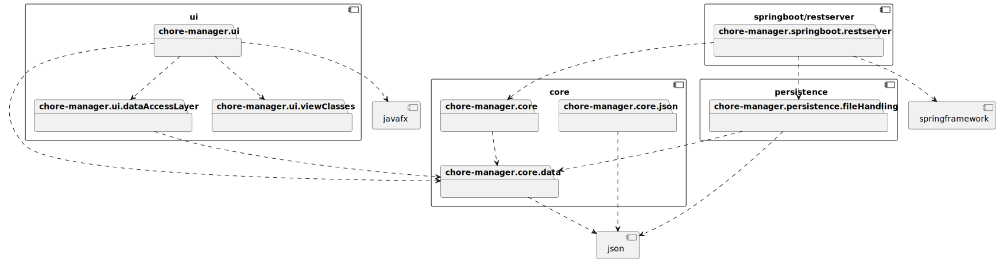

# Diagrams
We have used diagrams to help us visualize the architecture of our application. We have used the [PlantUML](https://plantuml.com/) language to create these diagrams. The diagrams are located in the `docs/release3/images/umlDiagrams` folder. 
### UMLDoclet
This projects also uses [UMLDoclet](https://github.com/talsma-ict/umldoclet) to generate UML class diagrams from our code. The diagrams are generated with the javadocs and can be viewed with the rest of our javadocs in [/chore-manager/target/site/apidocs/index.html](../../chore-manager/target/site/apidocs/index.html) after running `mvn verify`. 

 ||
 |:--:|
 | This is a class diagram for our most important classes in the core module|

 ||
 |:--:|
 | This is a simplified sequence diagram for when a user creates a chore|

 ||
 |:--:|
 | This package diagram shows the architecture of our application after implementing the REST API |