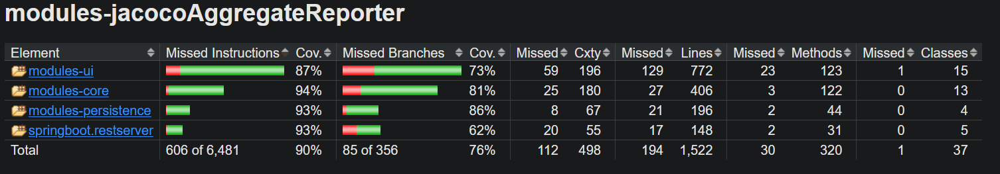
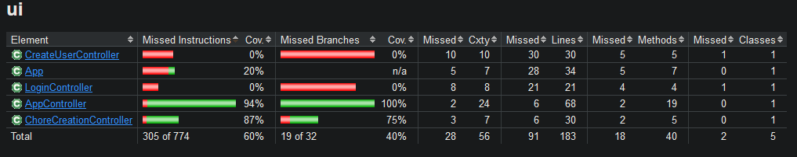
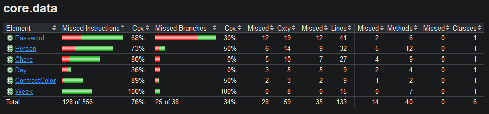
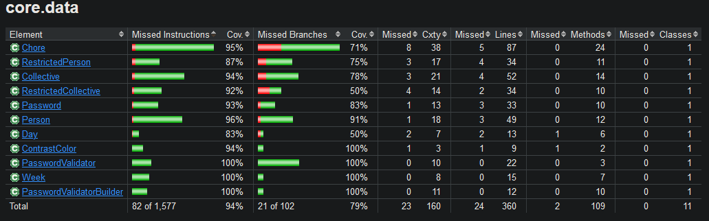
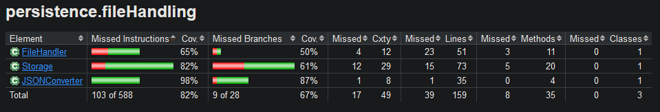
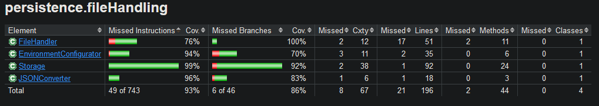

# Test coverage
According to JaCoCo, our line coverage was at 77% and our branch coverage was at 55% after the second deliverable. We have worked on improving our coverage as much as possible. However, some code branches are hard to get coverage for, since they are only executed in case of an error. We have tried to test these cases as well, but it is not always possible to get 100% coverage. There is also some code that makes no sense to test, i.e. the `main`-method in [`App`](/chore-manager/ui/src/main/java/ui/App.java) or the `main`-method in [`AppApplication`](/chore-manager/springboot/restserver/src/main/java/springboot/restserver/AppApplication.java). 

|||
|:--:|:--:|
|Our test coverage after deliverable 2 as reported by JaCoCo|Our final test coverage as reported by JaCoCo| 

|||
|:--:|:--:|
|Our test coverage in [ui](../../chore-manager/ui/src/main/java/ui/) after deliverable 2 as reported by JaCoCo|Our final test coverage in [ui](../../chore-manager/ui/src/main/java/ui/) as reported by JaCoCo| 

|||
|:--:|:--:|
|Our test coverage in [core](../../chore-manager/core/src/main/java/core/) after deliverable 2 as reported by JaCoCo|Our final test coverage in [core](../../chore-manager/core/src/main/java/core/) as reported by JaCoCo| 

|||
|:--:|:--:|
|Our test coverage in [persistence](../../chore-manager/persistence/src/main/java/persistence/) after deliverable 2 as reported by JaCoCo|Our final test coverage in [persistence](../../chore-manager/persistence/src/main/java/persistence/) as reported by JaCoCo| 

Even though our line coverage only increased from 77% to 90%, the amount of code (both lines and branches) in the project has increased by a lot. The total amount of lines and branches has more than doubled since deliverable 2. The amount of lines we test increased from 1849 to 5875 (217% increase) and the amount of branches we test increased from 66 to 271 (310% increase). We also test the UI a lot more thoroughly now. Previously our tests did not have very good branch coverage (40%), but now we have reached 72%. This reflects our renewed focus on ensuring that the application has a proper test suite, as well as a more test-driven approach to development.

When using JaCoCo, we learned that just looking at test coverage can be misleading. JaCoCo marks code as "covered" if it is run during the test phase. However, this does not mean that the code is explicitly tested. It might just be run as periphery code during another test. We have tried to avoid this issue by (1) being aware of it and (2) writing tests to explicitly test all the code we want to test. 

In accordance to the DRY (Don't repeat yourself) principle, we have used a `BaseTestClass` which all our other tests extend. This decision was made in order to avoid having a lot of boilerplate code in all of our test classes. Amongst other things, this includes methods like `setTestEnvironment` that sets the test environment, and methods such as `deleteFile` or `clearItems` that resets the state of the application between tests. This base class was especially useful for ui tests, since these tests also include boilerplate for handling the view as well as creating test persons and test collectives.

An issue we ran into when extending from the [base class in the ui module](../../chore-manager/ui/src/test/java/ui/BaseTestClass.java), was when we wanted to override the `setup` method. Since `setup` was used in static methods (decorated with `@BeforeAll`) it also had to be static - and we cannot override static methods. A possible solution to this was by adding `@TestInstance(Lifecycle.PER_CLASS)` to the base class. This meant that `@BeforeAll`-methods did not have to be static and could be overridden. We did not do this, the main reason being that the state of the test class would persist between tests. Our tests have been made with the assumption that the state resets between tests, meaning we would see unexpected behavior if we were to suddenly change this. The solution we went for was instead to change the extending class so it did not have to be override the `setup`-method.
